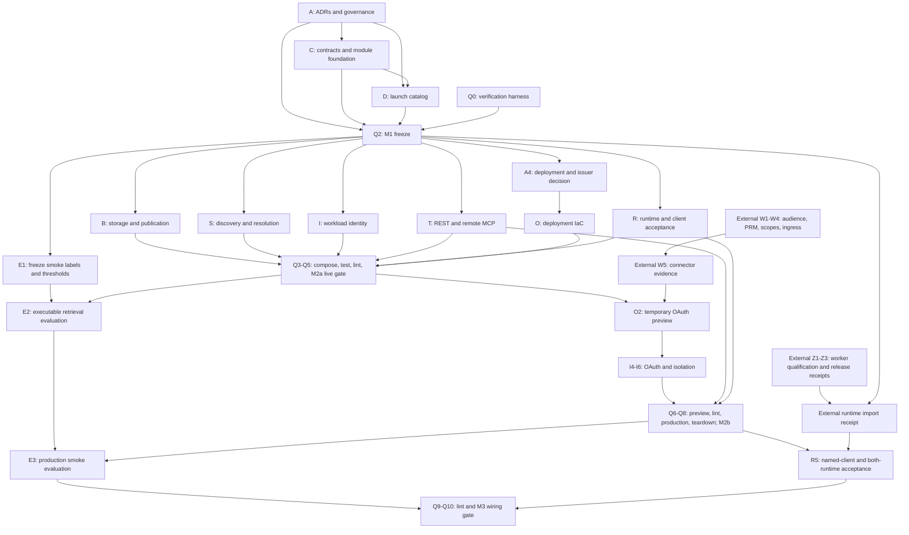

# Gist registry buildout: M1 through M3

Date: 2026 09 25 (UTC). Status: planned; no implementation or deployment claimed.
Work types: engineering, with content/architecture and provider-selection operations.

## Context

Build the hosted skill and execution-schema registry specified by
[RFC-002 revision 4](../rfc-002.md). Preserve the existing local Go library,
CLI, and stdio MCP server. The registry distributes complete Agent Skills
packages and execution schemas that compile into runtime tool contracts;
discovery and resolution confer no execution authority.

RFC-002 is the design authority. Section references below mean RFC-002 unless
qualified otherwise. [RFC-003](../rfc-003.md) is a boundary reference only:
retain its data-model hooks, but implement no gateway, execution endpoints,
credential vault, provider invocation, billing ledger, signing system, or
arbitrary provider egress. M4 full retrieval evaluation is also excluded.
Serving authenticated private catalogs at a public service origin is distinct
from public distribution of packages: the latter stays blocked under section 7.

This file is the complete implementation-plan artifact. The existing
[March feature plan](../plan.md) remains historical and unchanged. The
use-case manifest and proposed ADRs are embedded here because this planning
delivery permits only one file. Tasks A1-A4 materialize and settle the ADRs
during implementation; their proposed defaults are not already accepted.
No companion manifest, roadmap, ADR, or task file was written at planning time.
The explicit request for a prescriptive M1-M3 plan takes precedence over a
rolling-wave outline: downstream tasks are specified now, but must revalidate
their assumptions at each milestone join. Only dependencies, not calendar
dates or apparent readiness, authorize starting a task.

The external dependency identifiers W1-W5 and Z1-Z3 are opaque handoff IDs.
This public plan describes only the interfaces/evidence Gist consumes. It
neither identifies external projects nor assigns work inside them. External
coordination context is not part of the public artifact.

## Discovery Summary

Read-only inspection confirms the baseline in section 3:

| Existing surface | Reuse or boundary |
| --- | --- |
| `gist.go`: `Index`, `BatchIndex`, `Search`, `Stats` | Reuse through a scoped catalog-search adapter; preserve API behavior. |
| `search.go`: stemming, trigram, fuzzy fallback | Baseline lexical retrieval; no BM25 claim. |
| `store_postgres.go`: `ts_rank`; `store.go`: source/chunk store | Derived search only; neither supplies authoritative artifacts or tenancy. |
| `mcp/server.go`, `mcp/tools.go` | Local stdio tools and fixed initialization revision; hosted transport is separate. |
| `executor.go`, `session.go`, `snapshot.go` | Remain local; no hosted isolation or client-context-control claim. |
| Root `go.mod`, `.github/workflows/ci.yml`, `.golangci.yml` | Existing module and checks; new module must not add server dependencies here. |
| `docs/adr/001-003-*.md` | Memory store, byte visibility, local setup decisions; none covers registry architecture. |

There is no hosted module, authoritative registry API, OAuth service, or registry
acceptance suite in the inspected tree. The existing March plan is completed
local-feature work, not registry implementation evidence. No graph database was
available; discovery used public APIs, CLI entry points, route/transport code,
tests, module files, and documentation. These are source-inspection findings;
this planning run did not execute the test suite.

[The taxonomy](../taxonomy/gist-activities-1.md) contains 13 category, 74
process-group, and 362 process nodes. Preserve its machine-attached APQC
attribution and `apqc_ref` provenance. Its introductory edition-route example
differs from section 9; C1 follows section 9's two taxonomy routes and uses
returned canonical edition/node URLs. Do not add that example route silently.

Operations discovery: launch vendors have not been chosen. D1 must select 3-5
providers using demand and conformance evidence. Current catalog documentation
is not evidence that any provider works. Content discovery: the RFCs, taxonomy,
and three earlier ADRs exist; registry governance, authorization, deployment,
and client compatibility records are missing.

## Use Case Summary

Eleven use cases: nine P0 and two P1. UC-001 is WIRED in the existing local
surface, with tests present but not rerun here; UC-002 through UC-011 are
PLANNED. Infrastructure tasks use `verifies: [infrastructure]`. This table is
the embedded use-case manifest; no separate scratch manifest is required.

| ID / priority / domain | Actor and action | Preconditions / interfaces | Expected outcome and test data |
| --- | --- | --- | --- |
| UC-001 / P0 / local | Library or CLI user indexes and searches locally | Existing module; exported APIs, `gist` CLI, stdio MCP | Existing tests and outputs stay compatible without hosted credentials; use current local fixtures. |
| UC-002 / P0 / publishing | Maintainer publishes a reviewed immutable version | Authenticated maintainer with `catalog:publish`; publish REST routes | Complete private package and review provenance persist; fixture `asset-skill` with a reference and script. |
| UC-003 / P0 / discovery | Reader discovers relevant authorized candidates | Workspace reader; discover REST and `gist_discover` | Bounded, deterministic results or honest no-match; two workspaces with colliding titles. |
| UC-004 / P0 / artifacts | Reader fetches exact versions, packages, and schemas | Read permission; version/package/tool/capability REST and `gist_get` | Byte-exact complete content, pinned versions, validated digest; corrupt-file and oversize cases. |
| UC-005 / P0 / resolution | Runtime resolves all required capabilities | Pinned skill and runtime description; resolve REST and `gist_resolve` | Exact bindings, full per-requirement findings, no false ready; `multi-capability-skill`. |
| UC-006 / P1 / connections | User completes a delegated connection flow | Authorized unresolved binding; connections REST and `gist_connect` | Actionable URL/status or runtime-owned connection assertion, no credentials in responses. |
| UC-007 / P0 / isolation | Reader uses a private catalog without exposing another workspace | Validated subject/workspace; every REST/MCP boundary | IDs, counts, snippets, cursors, errors, downloads, caches and timing do not reveal foreign entries. |
| UC-008 / P0 / revocation | Runtime observes version changes and stops revoked use | Bound resolution and event cursor; events REST | Lease expiry and missed events force resync/recheck; local-copy limitation disclosed. |
| UC-009 / P0 / authentication | Workload or connector authenticates with bounded authority | Provisioned workload or OAuth consent; bearer, metadata, `/mcp` | Issuer/audience/scopes/membership enforced; refresh and revocation work across two workspaces. |
| UC-010 / P0 / runtime interoperability | Runtime imports or grants a resolved capability | Existing runtime lifecycle; REST/MCP adapter | Existing import/evaluation or exact-URI policy path retained; both archetypes exercised. |
| UC-011 / P1 / taxonomy | Reader filters by optional activity classifications | Authorized reader; taxonomy/discover REST | Attribution accompanies every response/copy; taxonomy never grants authority. |

Coverage manifest fields shared by PLANNED rows: `wiring_status=PLANNED`,
`coverage.interfaces_found=[]`, `coverage.has_tests=false`. Their interfaces
above are targets, not discovered implementations. UC-001 has interfaces
`library`, `cli`, `stdio_mcp` and `coverage.has_tests=true`. All synthetic test
data uses workspace keys `workspace-a` and `workspace-b`; never real customers.

## Scope and Deliverables

| Deliverable | Owner lanes | Acceptance gate |
| --- | --- | --- |
| M1 contracts, 3-5-provider catalog, two package examples, governance/authz/module ADRs, adapter contracts | A, C, D, Q | Q2; every section 15 M1 condition, including both Agent Skills interop directions. |
| M2a hosted registry, short-lived workload tokens, event feed, one real runtime | B, S, I, T, R, O, Q | Q5; production evidence plus local compatibility. |
| M2b reference AS, qualified delegation option, multi-tenant connectors | I, T, O, R, X, Q | Q8; preview first, production next, preview teardown recorded. |
| M3 named clients, both runtime archetypes, measured interactions and smoke retrieval eval | R, E, Q | Q10; no skipped required client or security/eval case counted as passing. |

## Dependency graph

W1-W4 are mandatory dependencies of the coordinated M2b lane; W5 supplies
the end-to-end ingress/discovery evidence before it starts. Passing them does
not select a delegated issuer automatically: I5 must pass every section 10
requirement. Built-in reference AS remains the default/fallback. External
identity work never blocks M1 or workload-token M2a. Z1 does not block local
or externally driven workers; Z2 may deliver an explicit memory deferral.
Z3 is the release receipt for the selected artifact-importing acceptance
runtime, not a prerequisite for authoring its Gist contract.

### What can start today

- A1 governance ADR, followed within lane A by A2 authorization and A3 module ADR.
- C1 endpoint/error inventory, using RFC requirements and marking open mechanics for A2.
- D1 launch-provider selection and demand scoring; no fixed vendor list.
- Q0 verification harness and test-environment contract.
- R1 runtime/client contract mapping and the time-boxed Grok Bot identification spike.
- X-W1, X-W2, X-W3, X-W4, X-Z1 and X-Z2 evidence requests/receipts externally.

Use four active local sessions initially: A1, C1, D1, Q0. R1 is the next
independent start when a slot frees. External work consumes no Gist editing
session until its receipt is available. This is a schedule, not an instruction
to launch agents during this planning delivery.

## Parallel Work: exclusive lane ownership

Every path is repository-relative. Directory ownership is exclusive and includes
tests and generated files. The task lists below narrow each write set to exact
files; brace notation expands to the finite named files. No task may edit an
unlisted path. A lane has at most one writer at a time, including formatter
fixes. Separate worktrees do not make overlapping writes permissible.

| Lane | Exclusive owned directories/files | First join / shared-file rule |
| --- | --- | --- |
| A: decisions | `docs/adr/004-registry-governance.md`, `005-registry-authorization.md`, `006-hosted-module.md`, `007-registry-deployment.md` | A1-A3 before Q2; A4 before deployment IaC and any M2b code. |
| C: contracts/foundation | `contracts/registry/v1/`, `hosted/go.mod`, `hosted/go.sum`, `hosted/internal/ports/`, `hosted/internal/contract/` | Sole schema, OpenAPI, shared Go type and module-dependency writer; freeze C7. |
| D: catalog | `catalog/registry/`, `docs/registry/catalog-selection.md`, `hosted/internal/seed/` | Consumes C7; never edits schema files. |
| B: persistence/publication | `hosted/migrations/`, `hosted/internal/storage/`, `hosted/internal/publication/`, `hosted/internal/packages/`, `hosted/internal/events/` | Consumes Q2 ports; all SQL migrations owned here, including auth tables. |
| S: search/resolution | `hosted/internal/discovery/`, `hosted/internal/resolution/` | Consumes Q2 interfaces; test doubles allowed only in tests. |
| I: identity/OAuth | `hosted/internal/identity/`, `hosted/internal/oauth/` | No SQL/migration or module-file edits; ask B/C owners for changes. |
| T: transports | `hosted/internal/rest/`, `hosted/internal/remotemcp/` | Consumes Q2 contracts; no business-policy copies. |
| R: consumers | `hosted/acceptance/clients/`, `hosted/acceptance/runtimes/`, `docs/registry/clients/`, `docs/registry/runtime-contracts.md` | No consumer-repository writes or global client-config changes. |
| O: operations | `deploy/registry/`, `.github/workflows/registry-{ci,release,preview}.yml`, `docs/registry/operations.md` | IaC and deployment workflow owner; never edits existing workflows. |
| E: retrieval evaluation | `eval/registry/`, `hosted/acceptance/retrieval/` | Labels freeze before running results; independent from S ranking code. |
| Q: integration/quality | `hosted/cmd/registry/`, `hosted/internal/app/`, `hosted/acceptance/wiring/`, `scripts/registry/`, `docs/registry/gates/`, this plan | Sole composition-root and milestone-report writer; reads all other lanes. |
| X: external receipts | `docs/registry/dependencies/` | Only interface evidence, never external implementation files. |

The root `go.mod`, `go.sum`, existing library/CLI/MCP code, existing CI/release
files, RFCs, old plan, and taxonomy source are read-only to every lane.
No `go.work` is introduced. C2 must predeclare required hosted dependencies;
other lanes use `-mod=readonly`. If a frozen interface or dependency must
change, Q pauses affected consumers, adds a C-owned amendment task and explicit
`depends_on` edges, then restarts consumers after that task lands. The same
rule applies to a B-owned migration change. Format/lint tasks report failures
to owners instead of modifying their files.

### Dispatch waves

These are capacity batches, not artificial dependencies. Tasks can advance as
soon as their listed dependencies pass and their lane is free. Within each
batch start exactly one session per listed lane, maximum four; a lane executes
its listed tasks serially. Subsequent tasks are never dispatched early merely
because their lane session exists.

| Wave | Sessions / lanes | Work and join |
| --- | --- | --- |
| 0 | 4: A, C, D, Q | A1-A3; C1; D1; Q0. R1 uses the first released slot. |
| 1 | 3: C, D, R | C2-C7; D2-D4 after C7; R1. Q1 then Q2 join after all prerequisites; A4 follows in one A session. |
| 2 | 4: B, S, I, T | B1-B5, S1-S3, I1-I3, T1-T3; all consume Q2. |
| 3 | 3: O, R, E | O1, R2, E1. Q3 composition follows; R3 then runs actual runtime/client checks, then Q4 lint and Q5 M2a. |
| 4 | 2: O, E | O2 and E2 independently after Q5. External W receipts must pass before O2. |
| 5 | 1: I, then 1: Q, then 1: R | I4-I6, Q6 preview composition, then R4 actual connector acceptance. The shared live boundary requires this order. |
| 6 | 1: Q, then 1: O, then 1: Q | Q7 lint, O3 production, O4 teardown, Q8 M2b. Security joins intentionally serialize. |
| 7 | 2: R, E | R5 and E3 run concurrently after Q8 and their external prerequisites. |
| 8 | 1: Q | Q9 final lint, Q10 M3 wiring verification. |

## Contract prescriptions to freeze at M1

### Schema inventory and endpoints

C3-C5 create exactly these JSON Schema 2020-12 files under
`contracts/registry/v1/`: `common.schema.json`, `manifest.schema.json`,
`inventory.schema.json`, `capability.schema.json`, `execution-schema.schema.json`,
`effects.schema.json`, `provider.schema.json`, `binding.schema.json`,
`golden-fixture.schema.json`, `taxonomy.schema.json`, `discover.schema.json`,
`resolve.schema.json`, `connection.schema.json`, `event.schema.json`,
`publish.schema.json`, `batch-get.schema.json`, and `error.schema.json`.
Each has a stable schema ID and explicit unknown-field policy; reject unknown
security-relevant fields. C1/C5 own `openapi.yaml` in that directory.

The following is the complete planned `/v1` route set. Rows tagged "choice"
make a concrete proposal where section 9 leaves an ellipsis or section 8 asks
for batch retrieval; C1/A2 must settle it before C7. All routes require
authentication. `catalog:read` covers reads; `catalog:publish` plus maintainer
policy covers publication. A publish scope alone is not read authority.

| Method and route | Boundary test required / source |
| --- | --- |
| `POST /v1/discover` | Authorized count/results, no-match, cursor binding, UTF-8 byte budget; section 9. |
| `GET /v1/skills/{id}/versions` | Lifecycle listing and authorized new-version notice; section 9. Keyset-paged by `limit` and `cursor` in SemVer order; amendment in ADR 005. |
| `GET /v1/skills/{id}/versions/{version}` | Full manifest, detached manifest integrity, exact instructions/references; section 9. |
| `GET /v1/skills/{id}/versions/{version}/package` | Complete bytes, headers, digest, denied conditional GET; section 9. |
| `GET /v1/tools/{id}/versions/{version}` | Full executable schema, canonical dialect, loss report; section 9. |
| `GET /v1/capabilities/{id}/versions/{version}` | Contract and binding conformance fixtures; section 9. |
| `POST /v1/resolve` | Every required capability has a finding; exact versions and bound lease; section 9. |
| `POST /v1/connections` | 201, authorized initiation URL and opaque pollable record, no credential fields; section 9. |
| `GET /v1/connections/{id}` | 200 status; foreign principal/workspace gets uniform 404; section 9. |
| `GET /v1/taxonomies` | Edition metadata with attribution; section 9. |
| `GET /v1/taxonomies/{id}/nodes` | Paginated attributed nodes, opaque edition key; section 9. |
| `POST /v1/publish/skills` | 201 immutable reviewed package; 409 changed bytes at same version; choice. |
| `POST /v1/publish/capabilities` | 201 governed contract; reject unowned prefix; choice. |
| `POST /v1/publish/tools` | 201 complete schema with capture provenance; choice. |
| `POST /v1/publish/providers` | 201 stable provider record; no network fetch; choice. |
| `POST /v1/publish/bindings` | 201 exact-version binding with successful goldens; choice. |
| `POST /v1/publish/taxonomies` | 201 edition with required attribution; choice. |
| `POST /v1/publish/revocations` | 201 immutable revocation notice and event; repeats return existing notice; choice. Revokes the named version in place and never creates a catalog version; amendment in ADR 005. |
| `POST /v1/identities/revoke` | 200 revokes a workload identity in the caller's own workspace (`identity:revoke` + maintainer); repeats return 200; missing or foreign is uniform 404. Amendment in ADR 005. |
| `GET /v1/events` | Authorized ordered notices, bound cursor, retention-gap recovery; section 9. |
| `POST /v1/artifacts/batch-get` | Exact typed references, bounded complete items and per-item denial, no truncation; choice for section 8. |

GET successes and discover/resolve/batch successes return 200; publication and
connection creation return 201. OpenAPI defines all request/response media
types, headers, size limits, idempotent repeat behavior, and examples.
Opaque URL-safe keys are distinct from slash-separated logical IDs. Clients
follow canonical URLs. Validate/escape versions and reject ambiguous encoded
slashes and traversal. No lookup route is an alias-based authorization shortcut.

Error envelope: `code`, safe `message`, `request_id`, `retryable`.
Enumerate every section 9 code: `unauthorized` (401), `forbidden` (403),
`not_found` (404), `version_conflict` (409), `budget_exceeded` (413),
`validation_failed` (422), `rate_limited` (429), `service_unavailable` (503).
Proposed additional codes to settle in A2/C1: `integrity_error` (422),
`artifact_revoked` (409), `cursor_expired` (409), `resolution_expired` (409).
All must have OpenAPI and REST/MCP fixtures. Expiry/revocation detail is returned
only after authorization; foreign objects remain indistinguishable 404s.
`payload_too_large` is the 413 condition, not a competing value of `code`:
emit `budget_exceeded`. OAuth's `invalid_token`, `invalid_grant`,
`invalid_scope`, and bearer `insufficient_scope` belong to their protocol
responses/challenges, not this catalog error enum. No exception text or account
identifiers appear in safe messages. 429 and retryable 503 use `Retry-After`.

Non-`/v1` surfaces: `/mcp`, `/healthz`, `/readyz`,
`/.well-known/oauth-protected-resource`,
`/.well-known/oauth-authorization-server`, `/oauth/jwks`, `/oauth/register`,
`/oauth/authorize` (GET/POST), `/oauth/token`, `/oauth/revoke`, and
`/oauth/consent` (GET/POST). A4/I4 settle AS route deployment and authenticated
user-session integration. Only health and intentional discovery metadata are
public resource endpoints; OAuth endpoints enforce their grant/client/user
requirements, and consent is never an unauthenticated approval operation.

### Digest closure, golden fixtures, and runtime field coverage

Section 6 fixes the non-self-referential closure: hash the file inventory
excluding the manifest itself. It does not fully specify canonical bytes or
where the manifest's own transfer digest resides. A3/C3 must settle these
mechanics with these recommended defaults:

1. `manifest.json` inventories all payload files with normalized relative path,
   byte size, SHA-256 digest, and media type. It does not inventory/hash itself.
   Inventory paths must be unique, traversal-free, regular files; reject
   undeclared archive members, links, and size mismatches.
2. Compute `package_digest` over a UTF-8 canonical JSON array of the inventory
   records sorted by path, using a pinned canonicalization algorithm. Archive
   timestamps/order/compression are not identity. Include known-vector fixtures.
3. The immutable version response contains a detached transfer inventory with
   the manifest's byte-exact digest/size as well as payload digests. Persist that
   manifest digest alongside the version record, outside the manifest. Verify
   the manifest bytes first, then every payload, then the package closure.
   This preserves section 6's requirement to verify transferred manifest bytes
   without a self-hash. Pin `(id, version)` and manifest version; no `latest` in
   resolutions. Any disagreement fails integrity; digest is not trust.

Golden fixtures are JSON documents validated by `golden-fixture.schema.json`:
`fixture_version`, `capability_id`, `contract_version`, `provider_id`,
`tool_id`, `tool_version`, `binding_id`, `binding_version`, and `cases`.
Each case has `name`, `capability_input`, `expected_provider_input`,
`provider_output`, `expected_capability_output`, `expected_effect_classes`,
and optional `expected_error`. Include happy path, missing required input,
extra forbidden field, boundary/enum failure, malformed provider output,
and a semantic mismatch that must refuse interchangeability. Tests transform
both directions without provider calls. Store fixture digest, adapter version,
run result, and timestamp on the binding; expose the conformance reference in
the manifest/capability response. Provider captures are sanitized and pinned.

The execution-schema/capability pair must unambiguously express tool identity
and version, input/output schemas and dialect, effect vocabulary version and
classes/sensitivity, outbound destinations, credential requirements (metadata,
never secrets), required scopes, cost currency/unit and upper bound or explicit
unknown/unbounded refusal, timeout, retry/idempotency semantics, and async status.
Include provider action/version, lifecycle, digest, provenance, capture time,
and `execution_location` (`client`, `runtime`, `gist_gateway`). Unknown required
fields cannot compile to a permissive runtime contract. No gateway evidence
enum is invented here; RFC-003's M-G1 ADR owns it.

### Proposed ADR records (to materialize in A1-A4)

Each ADR must contain `Status`, `Date`, `Context`, `Decision`, `Alternatives`,
`Consequences`, and `Verification`. Status starts `Proposed`; acceptance is an
explicit reviewed result. RFC-fixed invariants cite the RFC; these records
settle mechanisms and document rejected alternatives.

**ADR 004: Registry governance** (`docs/adr/004-registry-governance.md`).
Context: interoperable contracts require identifiable ownership and reproducible
conformance. Required additional sections and recommended decisions:

- `Capability ownership and disputes`: core operator vs workspace maintainer;
  owner registry, reviewer, appeal to core maintainers for core semantics;
  incompatible behavior gets a new contract, not a waived golden test.
- `Namespace reservation`: reserve `gist/`; bind each private prefix to its
  publisher/workspace using an audited reservation record; never reassign a
  prefix while versions exist; reject unauthorized-prefix publication with
  409 without exposing another owner's identity. Set collision and retirement
  procedures, including case normalization and confusable-name rejection.
- `Versioning and conformance`: section 11 additive-minor/semantic-new-version
  rules; exact binding pins, fixture format above, fixture ownership and
  compatibility dispute path.
- `Effects vocabulary`: each term declares `read_only`, `disclosure`, or
  `mutation` plus `normal` or `sensitive`; choose these wire spellings, define
  aggregation as the most restrictive class with sensitivity OR, and reject
  unknown terms/versions. Additions are minor; semantic changes/renames require
  a new version. No classification from prose or string-name matching.
- `Publisher review and screening`: validate the full package and summaries,
  inspect referenced scripts as text, detect prompt-injection/exfiltration
  instructions, hold uncertain content for review, record decision/reviewer,
  and reject visibility until passed. Never run hooks during import/indexing.
- `Trust and distribution`: section 7 `operator_asserted` ceiling; private
  only; no `verified` or public package distribution before the separate
  signing/provenance work and verification procedure exist.
- `Taxonomy and attribution`: stable capability IDs independent of paths,
  optional multiple memberships/tags, versioned editions, exact APQC block on
  every taxonomy response/copy, no taxonomy-derived authority.
- `Lifecycle`: immutable publication, deprecation vs revocation, review audit,
  manifest conformance references and publication/indexing states.

Consequences: curation slows ingestion but makes compatibility reviewable;
public service access does not make packages publicly distributable.
Verification: namespace collisions, failed goldens/screening, invalid effects,
public visibility and missing attribution all fail before publication.

**ADR 005: Registry authorization** (`docs/adr/005-registry-authorization.md`).
Context: both transports, caches, search and runtime leases share one boundary.
Required sections and recommended mechanisms:

- `Workspace selection and identity`: mint-time workspace claim in a signed
  token, selected through an authenticated membership check. Bind issuer,
  subject, audience, workspace, scopes and policy generation to every decision.
  Compare signed-selection grants as the rejected initial alternative; never
  trust request-body/header tenant IDs. Workspace switching requires reissue.
- `Roles, scopes and visibility`: reader and maintainer policy table for every
  route; scope is an upper bound, maintainer role alone is insufficient; public
  visibility reserved but blocked by ADR 004. Separate workload subjects from
  human users. Connection assertions do not widen authority.
- `Isolation`: scoped PostgreSQL queries plus forced RLS, separate migration
  and service roles, transaction-local principal/workspace context, pool-reset
  tests; object reads mediated by authorized service routes. Explain RLS-owner
  bypass and unscoped vocabulary/index queries as failure blast radii.
- `Route-by-route oracle policy`: 401 for invalid authentication; 403 for a
  known authorized resource/action lacking scope or role; uniform 404 for
  missing and unauthorized private references, including manifests, packages,
  tools, capabilities, taxonomy nodes, connections and bound resolutions.
  Lists omit inaccessible entries. Prefix collision remains generic 409.
  Authorize before ETag/304, size/HEAD-equivalent checks or expiry detail.
- `Cursors and resolutions`: random opaque IDs referencing server-side rows;
  bind principal/workspace/policy version, fixed maximum TTL, no mutable aliases.
  Resolutions pin skill, capability, tool and binding versions. Define sort
  stability and timing tests for missing vs foreign IDs, counts and snippets.
- `Failure matrix`: unavailable policy store or uncheckable membership always
  yields 503; unknown issuer key or unavailable required issuer/revocation
  check fails closed. Already validated keys may be used only within a bounded
  freshness policy and with live policy checks. Index outage fails discovery;
  pinned retrieval can continue when policy and artifact stores remain sound;
  no fabricated successful resolution on lookup failure.
- `Revocation leases and event feed`: recommend a 60-second maximum resolution
  lease, 5-minute cursor TTL, polling `GET /v1/events`, and 7-day retention.
  Event fields: event ID, type (`version_published`, `version_revoked`), exact
  typed artifact reference, timestamp and policy generation; authorized views
  only. Transactional outbox, ordered resumable delivery, duplicate-tolerant
  consumers. Retention gap returns `cursor_expired` with an authorized resync
  instruction; consumers stop dispatch, refresh versions/policy and re-resolve.
  Runtime rechecks at dispatch; local client execution remains advisory.
- `Cache/index discipline`: identity, workspace, scopes, policy generation,
  query and schema version in keys; policy check on every contacted read,
  including cache hits. No shared public cache of private artifacts. Revoked
  rows filtered using authoritative policy even while index/outbox lags.
  Private/no-store responses by default; immutable ETag never bypasses auth.
- `Budgets and test matrix`: enforced serialized-response `max_bytes`, labeled
  approximate estimator (recommend ceil(UTF-8 bytes/4), never a guarantee),
  complete required files/schemas or 413; IDs/cursors/counts/results/snippets/
  downloads/timing/cache/revocation/outage cross-product tests.

Consequences: online policy checks and short leases add cost; local downloaded
copies cannot be erased. Verification must cover two principals in one
workspace and one principal in two workspaces, not only two bearer strings.

**ADR 006: Hosted module and contract encoding**
(`docs/adr/006-hosted-module.md`). Context: section 3 forbids server dependencies
in the public library. Decision proposed: `hosted/` nested Go module, `GOWORK=off`,
root library consumed read-only, no root dependency changes; compare a sibling
repository and reject its cross-repo contract churn for initial delivery.
Additional sections: `Package boundaries`, `Consumer-owned ports`, `Dependency
versions`, `Digest canonicalization`, `Manifest transfer envelope`, `Runtime
contract compilation`, `Schema conversion losses`, `Testing and release`.
Choose pinned JSON Schema 2020-12 validation/canonicalization and maintained
OAuth/JOSE/transport primitives; standard library HTTP, flags and test harness
where practical, no hand-written cryptography. Pin versions in C2 after
official-documentation/security review at implementation time. Loss of
`additionalProperties`, `enum`, bounds or `required` must reject normalization
and mark the provider degraded; documentation-only loss is recorded.
Consequences: dual-module CI and explicit port maintenance. Verification: root
dependency graph unchanged, all digest vectors agree, and contract compilation
fails for missing security information.

**ADR 007: Registry deployment and issuer selection**
(`docs/adr/007-registry-deployment.md`). Context: section 5 requires the domain
decision before M2b; section 10 requires a reference AS fallback. Recommended
deployment surface: one Go service on Cloud Run, PostgreSQL metadata/policy,
private object storage for immutable bytes, Pulumi-managed resources with a self-hosted state backend,
and reviewed GitHub Actions releases. No hostname appears in artifact identity.
Additional sections: `Resource ownership`, `Final origin and audience`, `Domain
migration`, `Reference AS`, `Delegated issuer checklist`, `Workload tokens`,
`Limits/retention/SLOs`, `Preview ownership and TTL`, `Data residency and
subprocessors`, `Backups/restore/rollback`, `Release evidence`. Choose the
actual origin through deployment configuration before M2b; issuer/audience and
redirect migration require parallel explicit configuration and re-consent,
never token acceptance across resources by wildcard. Use IaC-created separate
preview DNS/audience, synthetic data, 24-hour maximum lifetime and workflow
teardown. No dormant staging environment is revived.
Consequences: preview lifecycle and reference-AS maintenance cost are explicit.
Verification: target-stack previews, isolated restore drill, OAuth checklist,
production test-account evidence, and preview destruction evidence.

## Checkable Work Breakdown

All tasks are open. `id` is the checkbox identifier; `Owner` and `owning_lane`
assign exactly one lane. `depends_on` is exhaustive. A component dependency
unblocks on its tested implementation/interface handoff; a milestone dependency
unblocks only on its final gate. Record components awaiting their milestone's
live checks as `implemented; live acceptance pending`, with the checkbox still
open. This lets the integration gate run without a circular requirement that
its components have already passed that same live gate. Engineering tasks carry
plain-language `acc:` predicates for just-in-time kazi dispatch; this plan does
not create kazi goals/proposals or invent CLI invocations. Content/operations
tasks use `delivers` and no `acc`. Design tasks are `kind: agent`; code tasks
are `kind: any` unless noted. Estimates are focused work excluding review,
build-lease wait, external handoff latency, and deployment approval.

Commands are future verification interfaces to implement in the named tasks,
not claims that they already exist. All Go commands run with `GOWORK=off` and,
after C2, `GOFLAGS=-mod=readonly`. Run package tests from `hosted/` when shown
that way. Every implementation task includes its listed automated tests;
HTTP tests hit a real `httptest.Server`/deployed router and assert status,
headers and body, not mocked handler return values. Q gates additionally test
the composed service against real PostgreSQL and object storage.

### E1: M1 decisions, contracts and curation

fidelity: executable

Acceptance: Q2 freezes complete contracts, validated catalog, ADRs and runtime
handoffs with every M1 condition in section 15 covered.

- [x] A1 Settle governance ADR. Owner: A. Est: 90m. kind: agent. owning_lane: A. depends_on: []. delivers: [ADR 004 accepted governance].
  - Files: create `docs/adr/004-registry-governance.md`.
  - Do: materialize the embedded ADR 004, settle each proposed mechanism, and record owner/reviewer roles and alternatives. Cite sections 7/11 instead of duplicating their settled rules.
  - Acceptance: every required section above exists; namespace allocation, conformance disputes, screening, vocabulary classes/sensitivity and private-only trust are decided without an unresolved implementation choice.
  - Verification: `test -s docs/adr/004-registry-governance.md`; review against the ADR 004 checklist above; `git diff --check`.

- [x] A2 Settle authorization ADR. Owner: A. Est: 90m. kind: agent. owning_lane: A. depends_on: [A1]. delivers: [ADR 005 accepted authorization and route-policy matrix].
  - Files: create `docs/adr/005-registry-authorization.md`.
  - Do: materialize ADR 005, including the full route matrix above, failure table, TTLs, feed retention/recovery, cache-key fields, token selection and test vectors. Resolve the proposed error additions with C1.
  - Acceptance: every section 12 requirement has a chosen mechanism and falsifiable test; foreign and nonexistent private references share status/body shape; fail-closed behavior and issuer outage policy are explicit.
  - Verification: `test -s docs/adr/005-registry-authorization.md`; trace each section 12 bullet to a named ADR section; `git diff --check`.

- [x] A3 Settle module and encoding ADR. Owner: A. Est: 90m. kind: agent. owning_lane: A. depends_on: [A2]. delivers: [ADR 006 accepted module and digest mechanics].
  - Files: create `docs/adr/006-hosted-module.md`.
  - Do: settle the embedded ADR 006, including the detached manifest hash, inventory canonical bytes, schema conversion policy and approved dependency versions. Compare nested vs sibling module and record consumer port signatures.
  - Acceptance: no digest self-reference; every required runtime-contract field has a source; root module remains untouched; schema/JOSE dependencies are version-pinned using current official evidence.
  - Verification: `test -s docs/adr/006-hosted-module.md`; manually recompute one documented digest vector independently; `git diff --check`.

- [x] C1 Enumerate the REST contract. Owner: C. Est: 90m. kind: any. owning_lane: C. depends_on: []. verifies: [UC-002, UC-003, UC-004, UC-005, UC-006, UC-007, UC-008, UC-011].
  - Files: create `contracts/registry/v1/openapi.yaml`, `contracts/registry/v1/route-matrix.json`.
  - Do: encode all 20 `/v1` method/path pairs above, statuses, scopes, canonical keys, max-byte semantics, and all eight baseline errors plus the four proposed additions. Mark open A2 choices pending C5, not silently accepted. Define batch results as complete items with per-item errors; aggregate encoded response exceeding budget fails 413.
  - Acceptance: every section 9 row has an operation and positive/negative examples; publish ellipsis is expanded; no execution operation; no taxonomy example-route drift.
  - Verification: `python3 -m json.tool contracts/registry/v1/route-matrix.json`; compare the complete method/path set and error enum to the tables above. Q0/C6 provide automated contract validation before C7 freezes it.
  - acc: [The route inventory contains every prescribed registry operation and zero execution operations.]

- [x] C2 Create the isolated hosted module and shared ports. Owner: C. Est: 90m. kind: any. owning_lane: C. depends_on: [A3]. verifies: [infrastructure, UC-001].
  - Files: create `hosted/go.mod`, `hosted/go.sum`, `hosted/internal/ports/{catalog,policy,search,connections,identity,events,clock}.go`, `hosted/internal/ports/contracts_test.go`.
  - Do: create the nested module with pinned dependencies and shared value types; ports separate catalog/object storage, authorization, lexical search, resolution, opaque connection initiation, identity records and event storage. Pass `context.Context` to I/O. Include transaction/outbox boundaries and principal/workspace policy context. Test doubles stay in tests.
  - Acceptance: ports support A2's auth tables, codes/sessions/refresh families, cursor/resolution records and outbox without a later cross-lane signature guess; no dependency added to root module.
  - Verification: `(cd hosted && GOWORK=off go test ./internal/ports)`; `git diff --exit-code -- go.mod go.sum`.
  - acc: [The hosted module compiles independently and the root module dependency files are unchanged.]

- [x] C3 Encode packages and digest closure. Owner: C. Est: 90m. kind: any. owning_lane: C. depends_on: [C1, C2]. verifies: [UC-002, UC-004, UC-010].
  - Files: create `contracts/registry/v1/{common,manifest,inventory}.schema.json`, `contracts/registry/v1/fixtures/digest-vectors.json`, `hosted/internal/contract/{package,digest,digest_test}.go`.
  - Do: implement the settled closure/envelope, Agent Skills metadata checks, complete inventory, publication-derived fields with unverified provenance, and immutable version validation. Do not execute scripts. Include changed manifest bytes, missing/extra file, duplicate/path-alias and encoding vectors.
  - Acceptance: valid bytes verify independently; tampering with any payload or detached manifest digest fails; Agent-Skills-only metadata is never guessed as verified.
  - Verification: `(cd hosted && GOWORK=off go test ./internal/contract -run 'TestDigest|TestPackage')`.
  - acc: [Package verification rejects any changed manifest or payload byte and accepts the canonical inventory vectors.]

- [x] C4 Encode semantics, effects and conformance. Owner: C. Est: 90m. kind: any. owning_lane: C. depends_on: [C3, A1]. verifies: [UC-004, UC-005, UC-010, UC-011].
  - Files: create `contracts/registry/v1/{capability,execution-schema,effects,provider,binding,golden-fixture,taxonomy}.schema.json`, `hosted/internal/contract/{compile,conversion,semantics_test}.go`.
  - Do: implement runtime-field coverage and golden format above; require exact binding versions and effect vocabulary classes. Include destination/credential/cost metadata. Normalize transport schema subsets only with loss reports and fail-closed treatment of security constraints.
  - Acceptance: a schema/contract pair compiles to the complete runtime record; omission of any required security field fails; doc-only loss is disclosed; security loss degrades the provider and blocks a resolvable binding.
  - Verification: `(cd hosted && GOWORK=off go test ./internal/contract -run 'TestCompile|TestConversion|TestEffects|TestGolden')`.
  - acc: [A complete execution schema compiles to a runtime contract while every security-constraint-loss fixture is rejected.]

- [x] C5 Complete wire schemas and freeze error semantics. Owner: C. Est: 90m. kind: any. owning_lane: C. depends_on: [C4, A2]. verifies: [UC-003, UC-004, UC-005, UC-006, UC-007, UC-008, UC-009].
  - Files: create `contracts/registry/v1/{discover,resolve,connection,event,publish,batch-get,error}.schema.json`, `contracts/registry/v1/fixtures/wire-cases.json`, `hosted/internal/contract/{wire,wire_test}.go`; modify `contracts/registry/v1/{openapi.yaml,route-matrix.json}`.
  - Do: finalize C1 against A2, including sizes, aliases-to-exact behavior, connection asserted/verified provenance, required vs optional capabilities, lease expiry, cursor binding and error retryability. Resolve the section 6 per-finding list vs section 8 `requires_gateway` gap by explicitly supporting `requires_gateway` at both finding and aggregate levels; explain this contract interpretation.
  - Acceptance: `ready` implies every required finding ready; no required file/schema truncation; every error has HTTP and MCP representation; runtime-owned connections never force a second consent flow.
  - Verification: `(cd hosted && GOWORK=off go test ./internal/contract -run TestWire)`; `python3 scripts/registry/check.py contracts`.
  - acc: [Wire validation rejects partial-ready resolutions and maps every catalog error to its documented status and body.]

- [x] C6 Add independent M1 API-contract tests. Owner: C. Est: 90m. kind: any. owning_lane: C. depends_on: [C5, Q0]. verifies: [UC-002, UC-004, UC-005, UC-007].
  - Files: create `hosted/internal/contract/{http_contract_test,schema_validation_test}.go`, `contracts/registry/v1/fixtures/http-cases.json`.
  - Do: run every positive/negative wire example through the selected schema validator and a test-only HTTP contract server; assert status and body for every operation, bad scope/error shape, 413 and 409. This is specification testing only; T and Q must replace test-double evidence with production-handler evidence later.
  - Acceptance: fixture count is nonzero per route; deleting a required field or weakening a constraint makes the suite fail; no passing verdict based only on parsing JSON.
  - Verification: `(cd hosted && GOWORK=off go test ./internal/contract -count=1)`.
  - acc: [All documented route fixtures are schema-validated and a deliberately invalid required-field fixture fails.]

- [x] C7 Freeze schemas and shared files. Owner: C. Est: 45m. kind: any. owning_lane: C. depends_on: [C6, A3]. verifies: [infrastructure].
  - Files: create `contracts/registry/v1/lock.json`; modify only C-owned files listed in C1-C6 if formatting corrections are necessary.
  - Do: format C Go files, validate OpenAPI/schema references, record hashes of all contract files and shared ports plus hosted dependency versions. Issue a read-only contract handoff to other lanes.
  - Acceptance: full schema inventory exists, lint passes, lock lists every schema and port; changes after freeze require a C-owned amendment and waiting consumers.
  - Verification: `python3 scripts/registry/check.py contracts --freeze-check`; `(cd hosted && GOWORK=off go vet ./internal/contract ./internal/ports)`.
  - acc: [The contract lock covers every schema and shared port and matches their current bytes.]

- [x] D1 Choose launch providers and first capability families. Owner: D. Est: 90m. kind: agent. owning_lane: D. depends_on: []. delivers: [3-5-provider selection with scored alternatives].
  - Files: create `docs/registry/catalog-selection.md`.
  - Do: score candidates for actual early workload demand, license/redistribution, immutable schema capture, safe fixture availability, explicit versions, effect/cost/credential metadata, semantic portability and maintenance burden. Select 3-5 with at least one aggregator (Composio-class is an example), one MCP server and one direct API. Keep aggregator/direct routes to the same service separate. Reject choices requiring gateway execution to prove registry correctness.
  - Acceptance: record selected names, public primary sources, scores, rejected alternatives and capture dates; cover taxonomy seed families `identity`, `communication`, `document`, `payment`, `case`, `approval`, `schedule`, `report`, `record`, `deploy` in a ranked shortlist. Recommend `identity`, `communication`, `document` for initial contracts when demand supports them; do not import every family merely for coverage.
  - Verification: `test -s docs/registry/catalog-selection.md`; manually verify provider-count and class coverage against the selection table; `git diff --check`.

- [x] D2 Ingest catalog records and binding goldens. Owner: D. Est: 90m per selected route. kind: any. owning_lane: D. depends_on: [D1, C7, A1]. verifies: [UC-002, UC-004, UC-005].
  - Files: create `catalog/registry/{providers,capabilities,tools,bindings,effects,goldens,captures}.json`, `hosted/internal/seed/{catalog,catalog_test}.go`.
  - Do: populate finite arrays for D1's selected providers, exact capture digests, owners, licenses, effects and binding fixtures. State catalog-only vs resolvable truthfully; no provider marked executable. All captures are offline uploads, not URLs fetched by the registry. Align chosen core contracts with taxonomy guidance without encoding taxonomy paths into identity.
  - Acceptance: 3-5 distinct provider records, all three route classes, every resolvable binding has passing input/output goldens and conformance metadata; no account IDs or credentials.
  - Verification: `(cd hosted && GOWORK=off go test ./internal/seed -run TestCatalog)`.
  - acc: [The curated catalog validates 3-5 providers across all three required route classes and every resolvable binding passes its goldens.]

- [x] D3 Produce both package interoperability fixtures. Owner: D. Est: 90m. kind: any. owning_lane: D. depends_on: [D2]. verifies: [UC-002, UC-004, UC-010].
  - Files: create `catalog/registry/packages/asset-skill/{manifest.json,SKILL.md,references/guide.md,scripts/example.sh}`, `catalog/registry/packages/multi-capability-skill/{manifest.json,SKILL.md}`, `catalog/registry/packages/agent-skills-only/SKILL.md`, `catalog/registry/packages/transfer-inventories.json`, `hosted/internal/seed/packages_test.go`.
  - Do: use an inert script and asset references in the first fixture; require at least two distinct capabilities in the second. Validate Gist instruction cores through a validating Agent Skills adapter; wrap the third using explicit publication metadata with derived fields marked unverified.
  - Acceptance: all files survive round-trip byte for byte, both import directions pass, immutable digests match, sentinel proves no script ran, capabilities cannot be silently dropped.
  - Verification: `(cd hosted && GOWORK=off go test ./internal/seed -run TestPackageInterop)`.
  - acc: [Both Agent Skills interoperability directions pass with complete assets and no script execution.]

- [x] D4 Export attributed taxonomy and test catalog wiring. Owner: D. Est: 90m. kind: any. owning_lane: D. depends_on: [D3]. verifies: [UC-011, UC-005].
  - Files: create `catalog/registry/taxonomy.json`, `catalog/registry/family-map.json`, `hosted/internal/seed/{taxonomy,taxonomy_test}.go`.
  - Do: derive edition 1 from the checked-in taxonomy; carry the exact attribution block, IDs, levels and provenance. Record chosen-family rationale and optional skill memberships. Do not edit or copy private prose from the taxonomy source.
  - Acceptance: 13/74/362 nodes, parent links and `apqc_ref` values preserved; every exported/paginated shape retains attribution; changing membership changes no grant or binding identity.
  - Verification: `(cd hosted && GOWORK=off go test ./internal/seed -count=1)`.
  - acc: [The taxonomy export preserves all 449 nodes and attribution without granting capability authority.]

### E2: M2a registry implementation

fidelity: executable

Acceptance: Q5 observes the hosted registry with workload tokens and one actual
runtime in sandboxed production workspaces, with existing local behavior intact.

- [x] B1 Implement authoritative storage and tenancy migrations. Owner: B. Est: 90m per migration/test slice. kind: any. owning_lane: B. depends_on: [Q2]. verifies: [UC-002, UC-007, UC-008, UC-009].
  - Files: create `hosted/migrations/{001_catalog,002_policy,003_identity,004_events}.sql`, `hosted/internal/storage/{postgres,objects,transactions,storage_test}.go`.
  - Do: implement C2 ports for immutable metadata/object references, policies/reservations, workload identities, OAuth codes/refresh families, connection handles, bound cursors/resolutions and transactional event outbox. Configure forced RLS with a non-owner application role and transaction-local context. Use private immutable object keys; downloads remain policy-mediated.
  - Acceptance: two-workspace integration tests reject unscoped reads/writes; rollback exposes neither partial version nor orphan event; connection records cannot contain provider secrets; pooled connections cannot retain prior tenant context.
  - Verification: `(cd hosted && GOWORK=off go test ./internal/storage -tags=integration -count=1)` with Q0's required PostgreSQL/object fixtures.
  - acc: [The application database role cannot read or write another workspace and failed transactions publish no version or event.]

- [x] B2 Implement package ingestion and review gate. Owner: B. Est: 90m per validation slice. kind: any. owning_lane: B. depends_on: [B1]. verifies: [UC-002, UC-004].
  - Files: create `hosted/internal/packages/{archive,validate,archive_test}.go`, `hosted/internal/publication/{review,publish,publish_test}.go`.
  - Do: consume uploaded bytes or an explicitly selected revision captured by an operator-side process, validate closure/Agent Skills/inventory/limits and screen package text per ADR 004. Reject traversal, absolute paths, links, decompression bombs, missing files and executable hooks. Publish all catalog artifact kinds atomically with review evidence and enqueue indexing.
  - Acceptance: immutable overwrite and unowned namespace return 409; failed review, unverified public distribution and unsafe archives never become visible; archive tests prove no code runs and no URL is fetched.
  - Verification: `(cd hosted && GOWORK=off go test ./internal/packages ./internal/publication -count=1)`.
  - acc: [Unsafe or unreviewed packages are rejected before visibility and a published version cannot change bytes.]

- [x] B3 Implement exact retrieval and version lifecycle. Owner: B. Est: 90m. kind: any. owning_lane: B. depends_on: [B2]. verifies: [UC-004, UC-007, UC-011].
  - Files: create `hosted/internal/packages/{retrieve,retrieve_test}.go`, `hosted/internal/storage/{versions,taxonomies,versions_test}.go`.
  - Do: return full immutable manifest envelope, package bytes, tool/capability contract and version list; implement paginated taxonomy data with attribution. Canonicalize mutable aliases before response, never in a resolution. Apply policy before size/digest/ETag responses and enforce max_bytes without truncation.
  - Acceptance: exact retrieval works while indexing is delayed; revoked/private visibility policy follows ADR 005; a denied request never gets 304 or a signed public object URL.
  - Verification: `(cd hosted && GOWORK=off go test ./internal/packages ./internal/storage -run 'TestRetrieve|TestVersions|TestTaxonomy')`.
  - acc: [Pinned package retrieval returns complete verified bytes despite index delay and rejects unauthorized conditional reads.]

- [x] B4 Implement lifecycle event delivery. Owner: B. Est: 90m. kind: any. owning_lane: B. depends_on: [B3]. verifies: [UC-008].
  - Files: create `hosted/internal/events/{outbox,feed,feed_test}.go`.
  - Do: expose the ADR 005 polling feed using transactional publication/revocation events and principal/workspace-bound opaque cursors. Implement retained-event cleanup and explicit gap recovery; duplicates are possible and documented. Do not build webhook delivery in this release.
  - Acceptance: no lost event between committed version and outbox; unauthorized entries never affect returned counts; expired cursors trigger resync, not a silent empty page.
  - Verification: `(cd hosted && GOWORK=off go test ./internal/events -tags=integration -count=1)`.
  - acc: [Committed publication and revocation produce authorized resumable events and an expired cursor requires resynchronization.]

- [x] B5 Test storage, publication and revocation failure boundaries. Owner: B. Est: 90m. kind: any. owning_lane: B. depends_on: [B4]. verifies: [UC-002, UC-004, UC-007, UC-008].
  - Files: create `hosted/internal/storage/isolation_test.go`, `hosted/internal/publication/failures_test.go`, `hosted/internal/events/recovery_test.go`.
  - Do: test concurrent same-version publication, transaction crashes, replayed cursors, policy-store outage, index lag, duplicate notices and artifact corruption using real backing stores. Assert no success from unavailable policy or fabricated state.
  - Acceptance: each failure yields the contract outcome and no leak; tests fail when tenant scoping or outbox atomicity is deliberately broken in an isolated test change, then pass after restoration.
  - Verification: `(cd hosted && GOWORK=off go test ./internal/storage ./internal/publication ./internal/events -tags=integration -count=1)`.
  - acc: [Cross-tenant and crash-recovery tests reject leaks and preserve publication-event atomicity.]

- [x] S1 Implement authorized lexical discovery. Owner: S. Est: 90m per ranking/query slice. kind: any. owning_lane: S. depends_on: [Q2]. verifies: [UC-003, UC-007, UC-011].
  - Files: create `hosted/internal/discovery/{index,search,cache,search_test}.go`.
  - Do: wrap reusable lexical components behind C2 ports; scope sources, vocabulary, queries and cache keys before ranking/limiting. Use deterministic tie-breaks and metadata filters. Keep authoritative revocation filtering on asynchronous index results. Empty/no-match is a successful empty result, never forced similarity.
  - Acceptance: hidden high-scoring candidates alter neither visible results nor counts; UTF-8 serialized output honors max_bytes; pinned retrieval is independent of this index; no shared unscoped local Store.
  - Verification: `(cd hosted && GOWORK=off go test ./internal/discovery -count=1)`.
  - acc: [Discovery ranks only authorized candidates and returns a valid empty result for no-match queries.]

- [x] S2 Implement complete resolution and connection delegation. Owner: S. Est: 90m per resolver/connection slice. kind: any. owning_lane: S. depends_on: [S1]. verifies: [UC-005, UC-006, UC-008, UC-010].
  - Files: create `hosted/internal/resolution/{resolve,connections,lease,resolve_test}.go`.
  - Do: evaluate every required capability against exact bindings/runtime requirements; store principal/workspace-bound resolutions and lease. Implement all six findings, explicit selection and trust disclosures. A runtime-owned connection assertion uses its existing lifecycle and remains client-asserted. For runtime-less clients, initiate only through an operator-configured external connection broker port returning a URL/opaque status; validate completion from that broker, never accept a model boolean as proof.
  - Acceptance: no second runtime consent flow; no provider-token custody, provider calls or gateway execution. If no connection broker is configured, connection initiation returns explicit service-unavailable and the capability stays unresolved. `gist_gateway` bindings report `requires_gateway`.
  - Verification: `(cd hosted && GOWORK=off go test ./internal/resolution -count=1)`.
  - acc: [Resolution reports every requirement honestly and distinguishes broker-verified connections from runtime assertions without storing provider credentials.]

- [x] S3 Test resolver and search authorization regressions. Owner: S. Est: 90m. kind: any. owning_lane: S. depends_on: [S2]. verifies: [UC-003, UC-005, UC-007, UC-008].
  - Files: create `hosted/internal/discovery/isolation_test.go`, `hosted/internal/resolution/policy_test.go`.
  - Do: test all finding aggregates, stale policy generation, swapped subject/workspace, cached revoked bindings, index/policy outages, selection ambiguity and unsupported local execution/filesystem needs.
  - Acceptance: partial resolution never ready; cache hits rerun policy; policy failure never degrades to allow; required metadata cannot be omitted to fit budget.
  - Verification: `(cd hosted && GOWORK=off go test ./internal/discovery ./internal/resolution -count=1)`.
  - acc: [Revoked, foreign, ambiguous and unsupported requirements never produce a ready resolution.]

- [x] I1 Implement workload identity and policy evaluation. Owner: I. Est: 90m per token/policy slice. kind: any. owning_lane: I. depends_on: [Q2]. verifies: [UC-007, UC-009].
  - Files: create `hosted/internal/identity/{workload,policy,keys,identity_test}.go`.
  - Do: provision workload principals via reviewed deployment configuration, using workload federation or an operator-controlled issuer process, never a pasted permanent bearer. Recommend signed JWT access tokens with 5-minute maximum life, `iss`, `sub`, `aud`, `exp`, `iat`, `jti`, selected workspace and explicit scopes; keys rotate by `kid`, algorithm allowlist, at most 30-second clock skew. No public arbitrary token-mint endpoint. Scope/membership changes require online policy checks and bounded key freshness per A2.
  - Acceptance: issuer, audience, expiry, signature, scope, workspace, revoked principal and policy-store failures are enforced; tokens cannot be used as provider credentials. Test M2a with two synthetic workspaces and narrow read/publish principals.
  - Verification: `(cd hosted && GOWORK=off go test ./internal/identity -run 'TestWorkload|TestPolicy|TestKeys')`.
  - acc: [Only unexpired audience-bound workload tokens with current workspace membership and sufficient scope authorize registry operations.]

- [x] I2 Add shared auth context and oracle controls. Owner: I. Est: 90m. kind: any. owning_lane: I. depends_on: [I1]. verifies: [UC-007, UC-009].
  - Files: create `hosted/internal/identity/{context,authorize,authorize_test}.go`.
  - Do: supply the shared principal context consumed by both transports and all cache/store calls; implement ADR 005 route decisions, uniform private denial and no client-supplied tenant authority. Emit safe correlated audit decisions without tokens/credentials.
  - Acceptance: same principal requesting same operation via REST or MCP yields same policy decision; membership revoked during a token lifetime is denied; denied existing/missing resources share a response shape.
  - Verification: `(cd hosted && GOWORK=off go test ./internal/identity -run TestAuthorize)`.
  - acc: [Authorization ignores caller-supplied workspace IDs and makes identical private-denial decisions for both transports.]

- [x] I3 Test workload revocation and outage cases. Owner: I. Est: 60m. kind: any. owning_lane: I. depends_on: [I2]. verifies: [UC-007, UC-008, UC-009].
  - Files: create `hosted/internal/identity/revocation_test.go`.
  - Do: exercise token/key rotation, unknown keys, unavailable policy/issuer checks, scope escalation, replay at another audience and two-workspace selection. Use controllable clocks instead of sleeps.
  - Acceptance: no acceptance beyond key/lease/token freshness bounds; outage matrix exactly matches ADR 005.
  - Verification: `(cd hosted && GOWORK=off go test ./internal/identity -race -count=1)`.
  - acc: [Token replay across resources and revoked-membership access fail even before token expiry.]

- [x] T1 Implement all REST routes over shared services. Owner: T. Est: 90m per route family. kind: any. owning_lane: T. depends_on: [Q2]. verifies: [UC-002, UC-003, UC-004, UC-005, UC-006, UC-007, UC-008, UC-011].
  - Files: create `hosted/internal/rest/{router,catalog,publish,connections,events,taxonomies,batch,errors,limits,router_test}.go`.
  - Do: bind every OpenAPI operation to C2 service ports, authenticate before parsing trusted context, implement request IDs, body limits, per-principal/workspace throttles, Retry-After, private cache headers and 304 policy rechecks. Publisher routes remain outside MCP. Enforce response-byte budgets on serialized bytes.
  - Acceptance: real HTTP tests assert successful and denied status/body for all routes including batch and 413; runtime-less connection URL/status actionable through configured broker; missing backend fails loudly, never mock-success production code.
  - Verification: `(cd hosted && GOWORK=off go test ./internal/rest -count=1)`.
  - acc: [Every frozen REST operation responds through shared service ports with tested success and denial envelopes.]

- [x] T2 Implement negotiated remote MCP. Owner: T. Est: 90m per negotiation/tool slice. kind: any. owning_lane: T. depends_on: [T1, R1]. verifies: [UC-003, UC-004, UC-005, UC-006, UC-009].
  - Files: create `hosted/internal/remotemcp/{transport,negotiate,tools,errors,transport_test}.go`.
  - Do: implement Streamable HTTP and pin supported revisions using current official spec and R1's target builds. Offer only `gist_discover`, `gist_get`, `gist_resolve`, `gist_connect`; `gist_get` supports the frozen bounded batch option. Separate HTTP authentication challenges from negotiated tool errors. Validate origins, sessions, body sizes, connection/rate limits and reject unsupported versions.
  - Acceptance: initialize/list/call/reconnect tests hit real HTTP; tools produce the same service results as REST; schema subset losses disclosed; local stdio initialization untouched; no tool-result-as-install or native hydration claim.
  - Verification: `(cd hosted && GOWORK=off go test ./internal/remotemcp -count=1)`.
  - acc: [Remote MCP negotiates a supported revision and serves all four catalog tools with explicit unsupported-version errors.]

- [x] T3 Add cross-transport route/error parity tests. Owner: T. Est: 90m. kind: any. owning_lane: T. depends_on: [T2]. verifies: [UC-003, UC-004, UC-005, UC-007, UC-009].
  - Files: create `hosted/internal/rest/contract_test.go`, `hosted/internal/remotemcp/parity_test.go`.
  - Do: replay C6's frozen boundary cases against production handlers, comparing application outcomes across transports. Cover conditional reads, expired cursors/resolutions, malformed request IDs, scope denial, oversize required content and throttling.
  - Acceptance: no operation/error omitted; test-only contract server evidence is superseded by actual handlers; protocol errors use the correct layer.
  - Verification: `(cd hosted && GOWORK=off go test ./internal/rest ./internal/remotemcp -count=1)`.
  - acc: [Production REST and MCP handlers enforce the same catalog authorization and error semantics for all parity cases.]

### E3: Runtime and named-client lane

fidelity: executable

Acceptance: R3 supplies M2a runtime evidence; R4 supplies M2b connector evidence;
R5 supplies the complete M3 client/archetype matrix.

- [x] R1 Map runtime contracts and identify clients. Owner: R. Est: 90m, including 30m spike. kind: agent. owning_lane: R. depends_on: []. delivers: [runtime handoff contracts and named-build target matrix].
  - Files: create `docs/registry/runtime-contracts.md`, `docs/registry/clients/{targets,grok-bot-spike}.md`.
  - Do: map section 13's two archetypes to fields, call sequence, error cases and evidence receipts. Policy-gated runtime: exact tool URI/version grants, parent bounds, spending policy separate, source references, dispatch recheck and event consumption. Import runtime: fetch/verify then existing upload/validate/evaluate/bind lifecycle, explicit update, no second install path. Both retain existing protected-effects machinery.
  - Acceptance: name actual public product/build targets for Codex, Claude Code, Cursor, Claude.ai and selected runtime products; choose one policy-gated runtime for M2a. Time-box Grok Bot vendor/transport/OAuth identification to 30 minutes; record unsupported/unidentified and exclude from acceptance unless evidence qualifies it. No bridge implementation assumed.
  - Verification: `test -s docs/registry/runtime-contracts.md`; `test -s docs/registry/clients/grok-bot-spike.md`; review every section 13 requirement against a handoff row.

- [x] R2 Build runtime contract probes and installation fixtures. Owner: R. Est: 90m per archetype. kind: any. owning_lane: R. depends_on: [Q2, R1]. verifies: [UC-004, UC-005, UC-008, UC-010].
  - Files: create `hosted/acceptance/runtimes/{policy_test,import_test,connections_test,events_test}.go`.
  - Do: create Gist-side probes for external runtime adapters, consuming receipts X-R1/X-R2 when available. Verify exact URIs/versions, no wildcard taxonomy grants, parent/spend separation, complete package verification, no silent update, runtime-owned connection challenge reuse, submission-key/timeout/effect-class mapping and revocation dispatch recheck. Do not implement the external adapters here.
  - Acceptance: probes reject bypassing either runtime's existing lifecycle or protected-effects engine; offline contract fixtures are labeled contract-only, never live runtime acceptance.
  - Verification: `(cd hosted && GOWORK=off go test ./acceptance/runtimes -run TestContract -count=1)`.
  - acc: [Runtime contract probes detect lost package assets, widened tool grants and bypassed connection or protected-effects lifecycles.]

- [x] R3 Exercise the M2a runtime and coding clients. Owner: R. Est: 90m. kind: any. owning_lane: R. depends_on: [R2, Q3, X-R1]. verifies: [UC-009, UC-010, UC-004].
  - Note (2026-09-27): R3's runtime tests ran with GIST_*_BUILD set to local@local-fixture placeholders, not released client/runtime builds. Its X-R1 dependency is still open. Real runtime verification is pending X-R1 and gates Q5.
  - Files: create `hosted/acceptance/clients/workload_test.go`, `docs/registry/clients/m2a.json`.
  - Do: prepare executable remote-MCP acceptance for pinned Codex/Claude Code builds and the selected policy-gated runtime with short-lived workload credentials; Q5 runs it against the deployed service. Record remote vs explicit local bridge and schema subset, token expiry, exact retrieval, errors and revocation evidence.
  - Acceptance: tests require configured targets and fail if absent; actual client/runtime build evidence is required at Q5, not just a generic HTTP client. No global client configuration changes. Production-observed completion is inherited from Q5.
  - Verification: `(cd hosted && GOWORK=off go test ./acceptance/clients -run TestWorkload -count=1)` against Q3's local service initially and Q5 production finally.
  - acc: [A named runtime and pinned Codex and Claude Code builds retrieve exact artifacts using short-lived workload authority.]

- [ ] R4 Add and exercise connector OAuth acceptance. Owner: R. Est: 90m per preview/live run. kind: any. owning_lane: R. depends_on: [Q6]. verifies: [UC-009, UC-004, UC-007].
  - Files: create `hosted/acceptance/clients/oauth_test.go`, `docs/registry/clients/m2b.json`.
  - Do: register Claude.ai custom connector against the isolated preview, complete discovery/DCR/consent/PKCE/retrieval/refresh/revoke and denial after revoke. Capture named client build/date and redacted protocol evidence. Repeat on production only through O3/Q8; include both workspaces and consent refusal. Use actual client UI plus automated protocol probes.
  - Acceptance: no localhost dependency or static remote bearer; refusal, refresh-family reuse and revoked membership are denied; preview proves the flow before production contact. Document residency/subprocessor implications for operators.
  - Verification: `(cd hosted && GOWORK=off go test ./acceptance/clients -run TestConnectorOAuth -count=1)` plus the recorded actual-client consent/retrieval session required by Q6/Q8.
  - acc: [The real connector completes OAuth discovery through revocation and cannot read another workspace in preview and production.]

- [ ] R5 Complete M3 named-client and dual-runtime matrix. Owner: R. Est: 90m per client/archetype. kind: any. owning_lane: R. depends_on: [Q8, R3, R4, X-R2]. verifies: [UC-004, UC-005, UC-009, UC-010].
  - Files: create `hosted/acceptance/clients/matrix_test.go`, `docs/registry/clients/m3.json`.
  - Do: run Codex, Claude Code, Cursor, one policy-gated runtime and one artifact-importing runtime using frozen exact package/schema fixtures. Retain Claude.ai M2b evidence and recheck retrieval. For each record product/build, transport, auth flow, supported schema subset/losses, results, complete package transfer and explicit unsupported local-runtime errors. Admit Grok Bot only if R1 qualified it.
  - Acceptance: both runtime archetypes pass through existing native lifecycles and exact-URI policy; measure discover/get/resolve/act network round trips separately and demonstrate batch retrieval reducing applicable fetches. Runtime act occurs outside Gist with safe sandbox actions; no gateway or hidden retry. Unsupported targets listed explicitly; a partial launch is not full M3 acceptance.
  - Verification: `(cd hosted && GOWORK=off go test ./acceptance/clients ./acceptance/runtimes -tags=live -count=1)`; `python3 scripts/registry/check.py evidence --milestone M3`.
  - acc: [All required named clients and both runtime archetypes pass live package and policy tests with measured single and batch round trips.]

### E4: Deployment and M2b OAuth

fidelity: executable

Acceptance: preview OAuth/isolation gates precede production, every deployment
uses IaC/release workflows, and delegated issuance passes the entire checklist.

- [x] O1 Build M2a IaC and release workflow. Owner: O. Est: 90m per resource/workflow slice. kind: any. owning_lane: O. depends_on: [A4]. verifies: [infrastructure, UC-009].
  - Files: create `deploy/registry/{Pulumi.yaml,requirements.txt,__main__.py,Containerfile,config.example.yaml}`, `.github/workflows/registry-{ci,release}.yml`, `docs/registry/operations.md`.
  - Do: define ADR 007's Cloud Run/PostgreSQL/private-object-store surface through Pulumi with self-hosted state, or record a reviewed A-owned ADR amendment before changing surface. Add workload-identity provisioning, secret references, least-privilege service role, database migration job, readiness/liveness, logs/request correlation, latency/error metrics, backups/restore and rollback. Build images with Podman. Set explicit initial package/expansion/request/catalog/concurrency limits, byte budgets and SLOs from curated baseline; record configuration, not magic constants.
  - Acceptance: target-stack preview and tests prove no public object access or embedded secrets; CI runs both modules independently; release workflow performs migrations/deploy/live checks and emits immutable evidence. No production claim yet; Q5 must deploy and verify.
  - Verification: `python3 scripts/registry/check.py iac`; `pulumi preview --cwd deploy/registry --stack production --diff` through reviewed CI with deployment configuration.
  - acc: [The registry IaC preview defines an isolated service with private artifact storage and a release workflow that requires live verification.]

- [x] A4 Settle deployment origin, issuer and preview ADR. Owner: A. Est: 90m. kind: agent. owning_lane: A. depends_on: [Q2]. delivers: [ADR 007 accepted before deployment and M2b].
  - Files: create `docs/adr/007-registry-deployment.md`.
  - Do: materialize the embedded ADR 007 using the curated-catalog baseline and the external interface contracts (receipts may still be pending). Choose built-in reference AS as default before M2a and leave delegation disabled until I5 passes. Resolve actual configurable final origin, resource audience, redirects/migration, reference-AS ownership, key storage, human login/session integration and preview teardown owner. Recommend a deployment-supplied authenticated identity session with explicit membership checks, CSRF protection and session binding; the reference AS owns consent and grants, not a new password database.
  - Acceptance: no unspecified domain/issuer/session mechanism remains when I4 starts; section 10 checklist is present; public documentation uses configuration variable names rather than private deployment values; residency/subprocessor disclosure recorded.
  - Verification: `test -s docs/adr/007-registry-deployment.md`; review section 5/10/14/16 decisions against named ADR sections; `git diff --check`.

- [ ] O2 Provision short-lived OAuth preview by IaC. Owner: O. Est: 90m. kind: any. owning_lane: O. depends_on: [Q5, A4, O1, X-W1, X-W2, X-W3, X-W4, X-W5]. verifies: [infrastructure, UC-009].
  - Files: create `deploy/registry/preview.py`, `.github/workflows/registry-preview.yml`; modify `deploy/registry/{__main__.py,config.example.yaml}`, `docs/registry/operations.md`.
  - Do: use an isolated public-origin stack with separate audience, redirects, synthetic workspaces, restricted secrets and mandatory TTL teardown. Add create/deploy/test/destroy workflow stages, target-stack preview approval and cleanup on failure. Never reuse production data or revive a dormant staging stack.
  - Acceptance: ingress reaches application challenges rather than infrastructure denial; preview tokens cannot access production; workflow records expiry/owner and schedules destruction. Gist code does not create external identity infrastructure.
  - Verification: `python3 scripts/registry/check.py iac --preview`; `pulumi preview --cwd deploy/registry --stack preview --diff` through the workflow; Q6 verifies deployed routes.
  - acc: [An IaC-created isolated preview exposes the configured OAuth resource and has enforced teardown and a distinct audience.]

- [x] I4 Implement built-in reference authorization server. Owner: I. Est: 90m per discovery/grant/session slice. kind: any. owning_lane: I. depends_on: [A4, O2, I3, B5]. verifies: [UC-009, UC-007].
  - Done (2026-09-27): merged in #31 (atomic code redemption, shared consent secret). Local acceptance only; live preview verification remains with O2/Q6.
  - Waiver (David, 2026-09-27): the formal dependency on O2 is waived for implementation and local acceptance. Live preview verification still requires O2.
  - Files: create `hosted/internal/oauth/{server,metadata,registration,authorize,consent,token,refresh,revoke,jwks,session,oauth_test}.go`, `hosted/internal/oauth/consent.html`.
  - Do: implement the entire section 10 requirement checklist below using reviewed maintained primitives; attach to configured authenticated identity session, explicit workspace selection and consent. B1 supplies all persistence; no hidden migration edits. PKCE S256 only, codes hashed/single-use, client+redirect+resource bound, scope reject-not-downgrade; rotate refresh tokens and revoke family on reuse; never persist raw refresh/code values.
  - Acceptance: real HTTP tests cover positive and negative flows including stolen code, redirect mismatch, consent denial/CSRF, two resources, role/scope escalation and workspace reissue. Both metadata documents and correct PRM challenge exist. Complete AS operates without a delegated issuer.
  - Verification: `(cd hosted && GOWORK=off go test ./internal/oauth -count=1)`.
  - acc: [The reference AS passes every metadata, registration, PKCE, refresh, PRM and resource-audience requirement without an external issuer.]

- [x] I5 Qualify optional delegated issuer and reject partial compliance. Owner: I. Est: 90m. kind: any. owning_lane: I. depends_on: [I4, X-W5]. verifies: [UC-009].
  - Done (2026-09-27): merged in #33. Checklist probes run against the local reference AS only; the external-issuer probe needs X-W5 and runs in Q6. Delegation stays disabled until then.
  - Files: create `hosted/internal/oauth/{delegated,checklist_test}.go`, `hosted/internal/oauth/issuer-checklist.json`.
  - Do: run identical conformance probes for built-in and configured external issuers, recording each checklist row per deployment/build. Require W1-W5 interface evidence plus complete runtime test results. Configure an explicit issuer allowlist; failed delegation configuration selects the built-in strategy during deployment, never silently accepts both issuers or downgrades a live session.
  - Acceptance: any missing checklist line blocks delegation; refresh preserves audience/scopes/workspace bounds; wrong-resource tokens get bearer invalid_token; no inference that W receipts alone prove compliance.
  - Verification: `(cd hosted && GOWORK=off go test ./internal/oauth -run TestIssuerChecklist -count=1)` against the local reference-AS HTTP server and the selected external test issuer; Q6 repeats the reference deployment probes in preview.
  - acc: [Delegated issuance is enabled only when every required issuer conformance probe passes.]

- [x] I6 Test multi-tenant OAuth and consent in a browser. Owner: I. Est: 90m. kind: any. owning_lane: I. depends_on: [I5]. verifies: [UC-007, UC-009].
  - Done (2026-09-27): merged in #33. Browser tests use agent-browser rather than Playwright, per the repo rule; 4 tests pass (golden path per tenant, denial, CSRF, cross-tenant). Also fixed consent under Referrer-Policy no-referrer (Origin: null).
  - Files: create `hosted/internal/oauth/{isolation_test.go,consent.spec.ts,package.json,package-lock.json,playwright.config.ts}`.
  - Do: automate real consent UI golden path and at least denial/CSRF/workspace-switch edges with pinned Playwright; test refresh reuse, revoked consent, missing membership, resource mix-up, issuer outage and cross-session replay at actual HTTP boundaries. No production data in browser fixtures.
  - Acceptance: all browser/API assertions pass against the real AS at an isolated HTTP test origin; Q6 repeats them after preview composition. No model field counts as authenticated human consent; live completion remains gated by Q8.
  - Verification: `(cd hosted && GOWORK=off go test ./internal/oauth -tags=integration -count=1)`; `(cd hosted/internal/oauth && npm ci && npx playwright test)`.
  - acc: [Consent browser tests and multi-tenant OAuth boundary tests deny cross-workspace, replay and refresh-reuse attempts.]

- [ ] O3 Release verified M2b to production. Owner: O. Est: 60m plus workflow time. kind: any. owning_lane: O. depends_on: [Q7]. verifies: [infrastructure, UC-009].
  - Files: modify `docs/registry/operations.md`; create `deploy/registry/release-evidence.json`.
  - Do: use reviewed IaC PR, CI, rebase merge, immutable release tag, deployment workflow and live checks. Reuse Q6's tested artifact; run migration/restore/rollback checks in isolated stores. Record deployment configuration hash, actual issuer checklist and redacted workflow evidence. No manual live infrastructure or database mutations.
  - Acceptance: production readiness, authorized retrieval and connector OAuth probes pass in sandboxed test workspaces; operator runbook gives rollback and backup/restore evidence. Failure stops release and executes workflow rollback.
  - Verification: `python3 scripts/registry/check.py release --milestone M2b`; `(cd hosted && GOWORK=off go test ./acceptance/wiring -tags=live -run TestM2b -count=1)`.
  - acc: [The release pipeline deploys the preview-tested artifact and live production authentication and retrieval checks pass.]

- [ ] O4 Tear down the temporary preview. Owner: O. Est: 30m. kind: any. owning_lane: O. depends_on: [O3]. verifies: [infrastructure].
  - Files: create `deploy/registry/preview-teardown.json`.
  - Do: run the reviewed preview workflow's destroy stage and verify preview-only resources, DNS and test-secret references are removed; revoke preview clients/tokens through authorized interfaces. Preserve sanitized evidence, not token material. Failure cleanup also runs if Q6/O3 fails; this task records successful terminal cleanup.
  - Acceptance: IaC state/output shows preview resources absent; production resource identities unchanged; TTL cleanup remains available on abandoned runs.
  - Verification: `python3 scripts/registry/check.py iac --teardown-evidence deploy/registry/preview-teardown.json` with workflow state evidence.
  - acc: [The preview stack is destroyed by its workflow and production resource identities are unchanged.]

#### Section 10 authorization-server requirement checklist

I4 implements all rows; I5 records pass/fail and evidence per deployment.

| Requirement | Required acceptance probe |
| --- | --- |
| RFC 8414 AS discovery | Metadata locates actual authorize/token/register/revoke endpoints and supported S256/resource behavior. |
| RFC 7591 DCR | Connector registers using HTTPS-only redirect URIs; invalid or excess scopes are rejected, never downgraded. |
| Authorization code + PKCE + consent | S256 only; code single-use and bound to client, redirect, resource and authenticated consent; denial issues no grant. |
| Refresh rotation and reuse containment | Refresh rotates once, preserves granted bounds; old-token reuse revokes its family; later refresh/access policy rejects revoked consent. |
| RFC 9728 PRM | Real protected-resource document, authorization-server list and catalog scopes; 401 challenge points to PRM, not AS metadata. |
| RFC 8707 resource/audience | Resource is bound at authorize, redemption and refresh; token for resource A is rejected by resource B. |

### E5: M3 smoke retrieval evaluation lane

fidelity: executable

Acceptance: E3 passes before Q10; this is a small labeled smoke gate, not M4's
full evaluation or a token-savings marketing claim.

- [x] E1 Freeze smoke labels, corpus and release thresholds. Owner: E. Est: 90m. kind: any. owning_lane: E. depends_on: [Q2]. verifies: [UC-003, UC-005, UC-007].
  - Files: create `eval/registry/{cases.jsonl,corpus.json,thresholds.json,README.md}`.
  - Do: define 24 deterministic cases: six exact/relevant intents, six no-match, six ambiguous intents and six unauthorized-candidate adversaries. Each JSONL row has case ID, query, principal/workspace fixture key, eligible/relevant exact artifact IDs, expected empty/ambiguous/ready behavior, forbidden IDs and max_bytes. Use at least two workspaces and confusable public descriptions. Human-review relevance independently of S's ranking; freeze hashes before running E2.
  - Acceptance: proposed smoke targets are explicit test targets, not observed results: zero unauthorized leakage, all no-match empty, all ambiguity cases avoid false ready and request selection where eligible bindings compete, all exact-target cases retrieve their labeled item in top 3. Report all 24 rows; do not tune labels to make results pass.
  - Verification: `python3 scripts/registry/check.py eval --labels-only`.
  - acc: [The frozen smoke set contains all 24 labeled cases with explicit forbidden IDs and non-vacuous release thresholds.]

- [x] E2 Implement reproducible retrieval smoke runner. Owner: E. Est: 90m. kind: any. owning_lane: E. depends_on: [E1, Q5]. verifies: [UC-003, UC-005, UC-007].
  - Done (2026-09-27): merged in #32, fixes in #34 (exact recall and ambiguous selection 0/6 to 6/6). Local composition only; the production run is E3.
  - Waiver (David, 2026-09-27): the formal dependency on Q5 is waived for implementation against the local composition. The production run remains E3.
  - Files: create `hosted/acceptance/retrieval/{smoke_test,metrics_test}.go`, `eval/registry/baseline.json`.
  - Do: call actual discover/get/resolve boundaries using the frozen corpus; record top-k recall, no-match accuracy, ambiguity handling, leak count, completion, bytes, labeled token estimates, p50/p95 and network round trips with client/build/config/corpus hashes. Include a deliberately unauthorized high-score candidate and negative-control run that makes the checker fail. Compare only matched catalogs/configurations.
  - Acceptance: all mandatory cases execute, zero skips, missing environment is failure; failure output identifies case IDs. No vector/reranker implementation, percentage savings target or broad benchmark expansion.
  - Verification: `(cd hosted && GOWORK=off go test ./acceptance/retrieval -count=1)`.
  - acc: [The smoke runner fails on a leaked candidate and reports reproducible per-case retrieval and interaction metrics.]

- [ ] E3 Run production smoke and publish measured results. Owner: E. Est: 60m. kind: any. owning_lane: E. depends_on: [E2, Q8]. verifies: [UC-003, UC-005, UC-007].
  - Files: create `eval/registry/{m3-results.json,m3-report.md}`.
  - Do: seed only synthetic sandbox workspaces through authorized publisher APIs, run the frozen suite on the public service, preserve redacted per-case evidence, and compare to E2 baseline. Route ranking fixes to S, contract fixes to C, and rerun changed affected evidence before the final full smoke.
  - Acceptance: every threshold in E1 passes; unauthorized IDs/counts/snippets absent; disclose unsupported cases and measured bytes/latency/round trips without claiming M4 coverage. A failed threshold blocks Q10.
  - Verification: `(cd hosted && GOWORK=off go test ./acceptance/retrieval -tags=live -count=1)`; `python3 scripts/registry/check.py eval --results eval/registry/m3-results.json`.
  - acc: [All 24 frozen smoke cases pass on the public deployment with zero unauthorized leakage and complete measured results.]

### E6: External dependency receipts

fidelity: executable

Acceptance: each receipt records its external owner role, interface revision,
test build/date, evidence location and pass/fail. These are operations/handoff
tasks, not Gist engineering tasks; no kazi predicate or invented external
command. X writes only the exact receipt files below. Secret-bearing evidence
stays out of the repository. External delays are reported, not implemented
around by modifying another project.

- [ ] X-W1 Accept resource-audience evidence. Owner: X. Est: 30m. kind: any. owning_lane: X. depends_on: []. blocked: external evidence pending. delivers: [W1 audience contract receipt].
  - Files: create `docs/registry/dependencies/w1.json`.
  - Contract/acceptance: resource bound to authorization code, token redemption and refresh; resource-A token rejected at B with 401 invalid_token; refresh preserves audience. Legacy behavior documented but not accepted for Gist. Unblocks X-W5/I5 and coordinated M2b only.
  - Verification: `python3 scripts/registry/check.py receipt docs/registry/dependencies/w1.json`; inspect attached negative audience test evidence.

- [ ] X-W2 Accept protected-resource discovery evidence. Owner: X. Est: 30m. kind: any. owning_lane: X. depends_on: []. blocked: external evidence pending. delivers: [W2 PRM contract receipt].
  - Files: create `docs/registry/dependencies/w2.json`.
  - Contract/acceptance: actual RFC 9728 PRM body lists resource, AS, scopes and bearer method; unauthenticated resource response's challenge points to PRM; client discovers AS from PRM alone. Unblocks X-W5/O2/I5.
  - Verification: `python3 scripts/registry/check.py receipt docs/registry/dependencies/w2.json`; inspect exact redacted body/header evidence.

- [ ] X-W3 Accept catalog-scope evidence. Owner: X. Est: 30m. kind: any. owning_lane: X. depends_on: []. blocked: external evidence pending. delivers: [W3 scope contract receipt].
  - Files: create `docs/registry/dependencies/w3.json`.
  - Contract/acceptance: issuer supports `catalog:read`/`catalog:publish`, rejects excessive/unknown scopes without downgrade, preserves scope on refresh and respects principal mint ceiling; unrelated scopes confer no catalog authority. Unblocks X-W5/I5.
  - Verification: `python3 scripts/registry/check.py receipt docs/registry/dependencies/w3.json`; inspect scope escalation/refresh tests.

- [ ] X-W4 Accept public ingress evidence. Owner: X. Est: 30m. kind: any. owning_lane: X. depends_on: []. blocked: external evidence pending. delivers: [W4 ingress contract receipt].
  - Files: create `docs/registry/dependencies/w4.json`.
  - Contract/acceptance: configured OAuth/discovery/MCP paths are reachable at a public HTTPS origin, unauthenticated MCP returns application 401/challenge rather than infrastructure 403; unrelated private paths remain protected; evidence comes from reviewed IaC/release verification. No external infrastructure instructions here. Unblocks X-W5/O2.
  - Verification: `python3 scripts/registry/check.py receipt docs/registry/dependencies/w4.json`; inspect target-deployment ingress checks.

- [ ] X-W5 Accept external connector end-to-end evidence. Owner: X. Est: 30m. kind: any. owning_lane: X. depends_on: [X-W1, X-W2, X-W3, X-W4]. blocked: external evidence pending. delivers: [W5 complete discovery and connector receipt].
  - Files: create `docs/registry/dependencies/w5.json`.
  - Contract/acceptance: real Claude.ai connector reaches registration, consent, token exchange and tenant-scoped operation on the externally configured resource; privileged operation preserves its approval policy. Record build and redacted trace. This receipt gates O2 and M2b implementation; Gist still runs its own full checklist and connector acceptance.
  - Verification: `python3 scripts/registry/check.py receipt docs/registry/dependencies/w5.json`; confirm all four prerequisite receipt revisions match the tested build.

- [ ] X-Z1 Accept optional hosted-worker qualification receipt. Owner: X. Est: 30m. kind: any. owning_lane: X. depends_on: []. blocked: external evidence pending. delivers: [Z1 declared model-worker operating mode].
  - Files: create `docs/registry/dependencies/z1.json`.
  - Contract/acceptance: selected importing runtime supplies a qualified model endpoint/profile and cost-bound evidence if using hosted workers, or declares externally driven worker mode for Gist acceptance. Do not choose its model, price or qualification procedure here. No M1/M2a blocker; informs Z3/R5 mode.
  - Verification: `python3 scripts/registry/check.py receipt docs/registry/dependencies/z1.json`; inspect qualification or explicit external-worker-mode statement.

- [ ] X-Z2 Accept memory-dependency disposition. Owner: X. Est: 30m. kind: any. owning_lane: X. depends_on: []. blocked: external evidence pending. delivers: [Z2 memory capability boundary].
  - Files: create `docs/registry/dependencies/z2.json`.
  - Contract/acceptance: runtime declares memory unavailable/deferred (recommended for this registry acceptance) or supplies its existing typed operation/evidence contract; Gist resolutions must report unsupported requirements honestly. Do not plan or implement a memory service. No registry feature depends on memory.
  - Verification: `python3 scripts/registry/check.py receipt docs/registry/dependencies/z2.json`; inspect explicit supported/unsupported capability declaration.

- [ ] X-Z3 Accept releasable importing-runtime build. Owner: X. Est: 30m. kind: any. owning_lane: X. depends_on: [X-Z1, X-Z2]. blocked: external release evidence pending. delivers: [Z3 pinned runtime release/installer receipt].
  - Files: create `docs/registry/dependencies/z3.json`.
  - Contract/acceptance: provide a named installable build, qualification result and known limitations for its existing artifact-upload/import/evaluate/bind APIs. Gist does not plan release fixes or installation internals. Unblocks X-R2's live receipt; no need to wait to write R1/R2 contracts.
  - Verification: `python3 scripts/registry/check.py receipt docs/registry/dependencies/z3.json`; inspect exact release/build digest and qualification evidence.

- [ ] X-R1 Accept policy-gated runtime adapter handoff. Owner: X. Est: 30m. kind: any. owning_lane: X. depends_on: [Q2, R1]. blocked: external adapter evidence pending. delivers: [one runtime adapter ready for workload-token acceptance].
  - Files: create `docs/registry/dependencies/policy-runtime.json`.
  - Contract/acceptance: selected R1 runtime implements its own adapter against frozen contracts, returns exact URI/version grants, parent bounds, independent spending checks, source references, connection assertion disclosure and dispatch revocation/event behavior. Evidence may initially target a test server; R3/Q5 prove production. No external adapter internals scheduled here.
  - Verification: `python3 scripts/registry/check.py receipt docs/registry/dependencies/policy-runtime.json`; compare the receipt to every R1 policy-archetype row.

- [ ] X-R2 Accept artifact-importing runtime adapter handoff. Owner: X. Est: 30m. kind: any. owning_lane: X. depends_on: [Q2, R1, X-Z3]. blocked: external adapter evidence pending. delivers: [released import adapter ready for M3].
  - Files: create `docs/registry/dependencies/import-runtime.json`.
  - Contract/acceptance: released runtime retrieves complete pinned packages, verifies closure, uses its existing artifact upload/validation/evaluation/worker binding, consumes version notices without silent update, and preserves its connection/protected-effects lifecycle. R5 supplies final live test. If an alternative runtime is selected, update this receipt/dependency explicitly; never claim the original dependency passed.
  - Verification: `python3 scripts/registry/check.py receipt docs/registry/dependencies/import-runtime.json`; inspect adapter contract and released-build evidence.

### E7: Integration, testing, formatting and milestone wiring

fidelity: executable

Acceptance: no milestone is done until its final wiring task passes. Component
tests, fixtures and document checks alone cannot close a hosted milestone.

- [x] Q0 Create verification harness and evidence rules. Owner: Q. Est: 90m. kind: any. owning_lane: Q. depends_on: []. verifies: [infrastructure].
  - Files: create `scripts/registry/{check.py,check_test.py,lint.sh}`, `hosted/acceptance/wiring/README.md`.
  - Do: implement the future commands referenced here: `contracts` validates inventory/references/examples via the hosted validator once C2-C6 exist; `receipt` validates revisioned evidence; `eval` checks label/result coverage; `iac` and `release` inspect workflow/config/evidence; `evidence --milestone` verifies required passing cases/build hashes. Reject absent files, zero tests, skipped required checks and mismatched artifact/config hashes. Define temporary PostgreSQL/object-store setup, `REGISTRY_BASE_URL`, audience, synthetic-account credential injection, artifact output location and explicit live opt-in. Secrets are environment/CI-injected, never committed. Use Podman fixtures or CI services, no Docker Compose dependency.
  - Acceptance: negative tests show missing/empty/stale evidence fails. Harness is a gate on real evidence, not a substitute for it; contract validation is not only a file-existence check. `lint.sh` is read-only: require empty `gofmt -l` and `goimports -l` results for owned Go files, run `go vet` and a compatible pinned `golangci-lint` on both modules separately, validate OpenAPI/JSON schemas, and run Python/TypeScript formatting and lint for added tooling/UI. Record the pinned tool versions in the script; fail on unavailable tools rather than omit a check.
  - Verification: `python3 -m unittest discover -s scripts/registry -p '*_test.py'`.
  - acc: [The verification harness rejects missing, skipped, empty and stale evidence rather than reporting a vacuous pass.]

- [x] Q1 Run M1 format, schema lint and tests. Owner: Q. Est: 60m. kind: any. owning_lane: Q. depends_on: [C7, D4, R1, Q0]. verifies: [infrastructure, UC-001].
  - Files: create `docs/registry/gates/m1-quality.json`.
  - Do: run formatting checks, OpenAPI/schema lint, fixture suites and root compatibility tests; record commands/build hashes. Return source fixes to owning lanes and rerun affected checks. Never format another lane's files from Q.
  - Acceptance: zero formatter/lint errors, complete test counts, root dependencies unchanged; no production deployment required for M1's offline contracts.
  - Verification: `sh scripts/registry/lint.sh M1`; `python3 scripts/registry/check.py contracts --freeze-check`; `(cd hosted && GOWORK=off go test ./internal/contract ./internal/seed ./internal/ports -count=1)`; `GOWORK=off go test ./... -count=1`.
  - acc: [Frozen contracts and seed fixtures pass lint and tests while all existing local package tests remain green.]

- [x] Q2 Verify final M1 wiring and freeze handoffs. Owner: Q. Est: 60m. kind: any. owning_lane: Q. depends_on: [A1, A2, A3, Q1]. verifies: [UC-002, UC-004, UC-005, UC-010, UC-011].
  - Files: create `docs/registry/gates/m1.json`.
  - Do: traverse seed skill -> inventory -> capabilities -> tools -> bindings -> goldens -> runtime contract and both package-import directions. Check all M1 section 15 bullets and approved ADRs. Lock endpoint/error/schema inventory and C-owned ports; issue external runtime handoffs only now.
  - Acceptance: asset and multi-capability examples resolve offline consistently, selected provider count/classes hold, review/private-trust/effects/taxonomy rules validate; no open authorization/digest/governance mechanism remains.
  - Verification: `python3 scripts/registry/check.py evidence --milestone M1`; `(cd hosted && GOWORK=off go test ./internal/contract ./internal/seed -count=1)`.
  - acc: [M1's complete package-to-binding-to-runtime-contract chain passes every declared milestone gate.]

- [x] Q3 Compose the hosted service and test actual boundaries. Owner: Q. Est: 90m per composition/test slice. kind: any. owning_lane: Q. depends_on: [B5, S3, I3, T3, R2, O1]. verifies: [UC-002, UC-003, UC-004, UC-005, UC-006, UC-007, UC-008, UC-009].
  - Files: create `hosted/cmd/registry/main.go`, `hosted/internal/app/{app,config,app_test}.go`, `hosted/acceptance/wiring/{m2a_test,isolation_test,boundaries_test}.go`.
  - Do: wire real PostgreSQL/object store, scoped lexical indexing, policy, workload issuer verification, resolver, connection-broker adapter and both transports. Set explicit limits, graceful cancellation/readiness and request correlation. Replay every C1 route/error case against actual HTTP handlers and backing services; include two-tenant oracle timing distributions with a documented tolerance and equal logical work (no arbitrary sleeps).
  - Acceptance: no production stubs; health distinguishes policy/store outages; connection initiation and polling work with a configured external broker without secret custody; absent broker reports explicit failure. Every endpoint has status/body tests and policy-before-rank/cache/304 coverage.
  - Verification: `(cd hosted && GOWORK=off go test ./internal/app ./acceptance/wiring -tags=integration -count=1)`.
  - acc: [The composed registry serves every API route using real storage and rejects all tested cross-tenant and outage paths.]

- [x] Q4 Run M2a full tests and formatting/lint. Owner: Q. Est: 60m. kind: any. owning_lane: Q. depends_on: [Q3, R3]. verifies: [infrastructure, UC-001].
  - Files: create `docs/registry/gates/m2a-quality.json`.
  - Do: run scoped race tests on concurrent hosted packages, full module suites and formatter/linter checks after all M2a code. Ensure tools are pinned and both modules use separate dependency graphs. Missing integration fixtures fail rather than skip.
  - Acceptance: zero lint/format errors; root CLI/stdio/library regression tests pass; no dependency pollution; evidence names test count and environment.
  - Verification: `sh scripts/registry/lint.sh M2a`; `(cd hosted && GOWORK=off go test ./... -tags=integration -count=1)`; `GOWORK=off go test ./... -count=1`; `(cd hosted && GOWORK=off go test ./internal/discovery ./internal/events ./internal/remotemcp -race -count=1)`.
  - acc: [Both modules pass their tests and format/lint gates without adding hosted dependencies to the public library.]

- [ ] Q5 Deploy and verify final M2a wiring. Owner: Q. Est: 90m plus workflow time. kind: any. owning_lane: Q. depends_on: [Q4, O1, R3, X-R1]. verifies: [UC-003, UC-004, UC-005, UC-007, UC-008, UC-009, UC-010].
  - Held for David (2026-09-27): needs production credentials and a real X-R1 runtime handoff. Agents do not run it.
  - Files: create `docs/registry/gates/m2a.json`.
  - Do: trigger the reviewed O1 release workflow after PR/CI/merge/tag; use dedicated sandboxed workspaces, never manual infrastructure changes. Run actual Codex/Claude Code and selected-runtime workload acceptance, full package download, version change/revocation feed, 413/no-truncation and issuer/audience denial checks. Confirm exact retrieval during controlled index lag without disabling production shared services.
  - Acceptance: live production URLs/config hashes are captured in access-controlled evidence; public report is redacted. One real runtime passes, tokens expire, per-requirement findings honest, limits enforced, existing local release compatible. A CI-only pass does not close M2a.
  - Verification: `(cd hosted && GOWORK=off go test ./acceptance/wiring ./acceptance/clients ./acceptance/runtimes -tags=live -run 'TestM2a|TestWorkload' -count=1)`; `python3 scripts/registry/check.py evidence --milestone M2a`.
  - acc: [The public registry passes workload-token discovery, exact retrieval, resolution and revocation with a real runtime and named coding clients.]

- [ ] Q6 Wire OAuth and verify M2b preview. Owner: Q. Est: 90m. kind: any. owning_lane: Q. depends_on: [I6, O2, Q5]. verifies: [UC-007, UC-009].
  - Files: modify `hosted/internal/app/{app,config,app_test}.go`; create `hosted/acceptance/wiring/{m2b_test,oauth_test}.go`, `docs/registry/gates/m2b-preview.json`.
  - Do: mount reference AS/PRM, select only the qualified issuer configuration, enforce shared identity across REST/MCP sessions and deploy via preview workflow. Run section 10 checklist, browser consent, automated connector-protocol probes, session negotiation/reconnect, request limits, cross-tenant caches and outage tests. Hand the deployed composed preview to R4 for the actual connector product test; do not count probes as that evidence.
  - Acceptance: all checklist rows and tenant-boundary tests pass in preview before production connector contact; reference-AS fallback independently works; wrong audience/issuer/session fail closed; the composed preview is ready for R4.
  - Verification: `(cd hosted && GOWORK=off go test ./acceptance/wiring ./internal/oauth -tags=integration -count=1)` against preview; `python3 scripts/registry/check.py evidence --milestone M2b-preview`.
  - acc: [The fully composed preview passes the entire OAuth checklist and connector flow while denying cross-tenant and cross-resource access.]

- [ ] Q7 Run M2b formatter/lint and release regression tests. Owner: Q. Est: 60m. kind: any. owning_lane: Q. depends_on: [Q6, R4]. verifies: [infrastructure, UC-001, UC-009].
  - Files: create `docs/registry/gates/m2b-quality.json`.
  - Do: run both modules, OAuth/browser suites, IaC checks and read-only formatting/lint after composition changes; bind evidence to the exact release image/config.
  - Acceptance: no skipped auth/browser tests; no formatter/linter findings; external issuer failure cases and built-in fallback remain green.
  - Verification: `sh scripts/registry/lint.sh M2b`; `(cd hosted && GOWORK=off go test ./... -tags=integration -count=1)`; `(cd hosted/internal/oauth && npx playwright test)`; `GOWORK=off go test ./... -count=1`.
  - acc: [The M2b release artifact passes module, OAuth, browser, IaC and formatting checks after final composition.]

- [ ] Q8 Verify final M2b production wiring and cleanup. Owner: Q. Est: 60m. kind: any. owning_lane: Q. depends_on: [O3, O4, Q7, R4]. verifies: [UC-007, UC-009, UC-004].
  - Files: create `docs/registry/gates/m2b.json`.
  - Do: rerun actual connector connection/consent/retrieval/refresh/revocation against production test workspaces; attach residency disclosure, issuer checklist, ingress/PRM evidence and preview teardown result. Test read denial after revoke without logging token values.
  - Acceptance: all section 15 M2b conditions pass against the public deployment, preview is gone, and no private package is publicly distributable. W receipts alone never satisfy this gate.
  - Verification: `(cd hosted && GOWORK=off go test ./acceptance/wiring ./acceptance/clients -tags=live -run 'TestM2b|TestConnectorOAuth' -count=1)`; `python3 scripts/registry/check.py evidence --milestone M2b`.
  - acc: [Production connector OAuth and tenant isolation pass and the temporary preview is confirmed removed.]

- [ ] Q9 Run M3 final test and lint gate. Owner: Q. Est: 60m. kind: any. owning_lane: Q. depends_on: [R5, E3]. verifies: [infrastructure, UC-001, UC-010].
  - Files: create `docs/registry/gates/m3-quality.json`.
  - Do: run final formatter/lint, both module regression suites and verify client/eval evidence hashes against the deployed build. Any resulting source fix reopens its owner task and invalidates affected live evidence until rerun.
  - Acceptance: no stale or partial client/eval results; root compatibility and hosted checks pass after all final fixes.
  - Verification: `sh scripts/registry/lint.sh M3`; `(cd hosted && GOWORK=off go test ./... -tags=integration -count=1)`; `GOWORK=off go test ./... -count=1`.
  - acc: [Final client and evaluation evidence matches a lint-clean build whose hosted and local regression suites pass.]

- [ ] Q10 Verify final M3 wiring and acceptance dossier. Owner: Q. Est: 60m. kind: any. owning_lane: Q. depends_on: [Q9, R5, E3, Q8]. verifies: [UC-003, UC-004, UC-005, UC-007, UC-009, UC-010].
  - Files: create `hosted/acceptance/wiring/m3_test.go`, `docs/registry/gates/m3.json`; modify `docs/plans/registry-buildout.md` only to record completion/evidence.
  - Do: run end-to-end publish -> discover -> full get/batch -> resolve -> runtime-native act/import -> revoke/recheck. Verify the M3 named-build matrix, both archetypes, unsupported local-runtime errors, transfer integrity, exact-URI authority, measured round trips and E3's smoke gate. No gateway act endpoint. Re-run Q9 checks for this final test file before accepting the dossier.
  - Acceptance: all M1-M3 gates have current evidence, all 24 smoke cases pass, every required client/archetype succeeds or the release is explicitly partial with M3 still open. No unsupported client is relabeled passing.
  - Verification: `(cd hosted && GOWORK=off go test ./acceptance/wiring -tags=live -run TestM3 -count=1)`; `sh scripts/registry/lint.sh M3`; `python3 scripts/registry/check.py evidence --milestone M3`.
  - acc: [The complete registry-to-runtime workflow and every required named-client and retrieval-smoke gate pass on the released build.]

## Timeline and Milestones

Dates follow evidence and external readiness; no fixed delivery date is implied.
Multi-slice estimates above must be dispatched as sequential 30-90 minute
sessions in the same lane, with the task kept open until all listed acceptance
criteria pass. A task's source changes may land before live acceptance, but a
production-facing task is not complete until its milestone's live gate passes.

| Milestone | Dependency join | Exit condition |
| --- | --- | --- |
| M1 | A1-A3, C7, D4, R1 -> Q1 -> Q2 | Frozen reviewed contracts/catalog/ADRs; independent of external identity work. |
| M2a | B5, S3, I3, T3, R3, O1, X-R1 -> Q3/Q4 -> Q5 | Live hosted registry and one workload-authenticated runtime, local compatibility intact. |
| M2b | A4, Q5 plus W1-W5 -> O2 -> I4-I6 -> Q6 -> R4 -> Q7 -> O3/O4 -> Q8 | Preview then public OAuth/connector/isolation evidence and teardown. |
| M3 | Q8, X-R2 (including selected runtime release), R5, E3 -> Q9 -> Q10 | Required clients and both runtimes pass; frozen smoke gate and measured interactions pass. |

## Risk Register

| Risk | Impact / likelihood | Mitigation / owner |
| --- | --- | --- |
| Ambiguous manifest self-digest interpretation | High / high | A3/C3 settle detached transfer hash with independent known vectors before freeze. |
| Contract drift causes cross-lane file collisions | High / medium | C exclusively owns schemas, ports and module files; explicit amendment dependencies pause consumers. |
| Tenant leaks through vocabulary, caches, 304 or index lag | Critical / medium | A2 unified rule; B/S/I/T tests; Q3 real-store adversarial matrix. |
| External issuer partially supports OAuth | High / high | X receipts plus I5 full checklist; built-in reference AS always available; no silent issuer mixing. |
| External runtime release delays M3 | Medium / medium | R1/R2 work immediately from frozen contracts; X-Z3 receipt gates only chosen runtime live acceptance. |
| Provider schema normalization drops security constraints | High / medium | C4 loss matrix, degraded state and golden rejection; never permissive conversion. |
| Registry connection flow grows into credential custody | High / medium | Opaque broker initiation/status only; runtime-owned lifecycle preferred; RFC-003 remains separate. |
| Public origin is mistaken for public package permission | High / medium | A1/B2 private-only publication, signing deferred, explicit live tests. |
| Fake-positive test/eval gate | High / medium | Q0 rejects missing/skipped evidence, E2 negative control, real client and live-service traces. |
| Preview lingers or touches production data | High / medium | Separate stack/audience, synthetic data, TTL and failure cleanup; O4 mandatory before Q8. |
| Future standards/client revisions differ | Medium / high | Pin official-spec revision and named builds during C2/T2/R1; record subset and unsupported targets. |

## Operating Procedure

1. At each lane start, read the frozen contract lock, applicable ADRs and task
   dependencies. Use an isolated checkout and the exact write set. Do not
   modify another lane's files, external repositories, existing local APIs or
   global client configuration. Q is the sole plan writer.
2. Keep standard-library Go patterns where practical, table-driven tests,
   explicit errors and bounded goroutine lifetimes. No production stubs or
   fabricated fallback success. `GOWORK=off` is mandatory. Only C may change
   hosted dependencies, and the root module remains unchanged.
3. On shared machines, check load and obtain the configured shared build lease
   before multi-package Go builds/tests/lint; release it immediately afterward.
   Hold if one-minute load exceeds 10. At most two heavy build sessions per
   project, and only one full race-suite session. Commands here do not bypass
   those machine-local controls.
4. Each behavior change needs a meaningful automated test. API/contract work
   asserts actual HTTP status and body; UI changes include browser golden and
   edge paths. Gates fail on missing credentials/environments rather than
   turning required checks into skips. Test secrets enter through approved
   environment/CI injection and never appear in artifacts or logs.
5. Run scoped tests while implementing, then explicit milestone tests/lint.
   Format only owned files. Q records findings and routes repairs back to the
   owning lane; it cannot take a broad formatting pass over another lane.
6. Deployment path is IaC change -> reviewed PR -> CI -> rebase merge ->
   immutable release -> deployment workflow -> live verification. No manual
   infrastructure mutations, direct production DB writes, force-pushes or
   retagging. Preview is created and destroyed through the same workflow
   discipline. This plan itself authorizes no deployment.
7. Production-facing task acceptance includes deployment and observed live
   verification in its milestone gate. M1's offline artifacts have no live
   service yet and use the contract/conformance gate instead. Do not report
   preview-only or test-double evidence as production acceptance.
8. Each gate records task IDs, source/image/contract/config hashes, named client
   builds, commands, test counts, observed statuses, evidence references and
   redacted failure detail. Public artifacts contain no private origins,
   operator identities, account data, tokens or local machine paths.
9. Preserve unresolved decisions as open tasks. A failed gate reopens affected
   tasks; changing schema/labels/issuer/build invalidates corresponding evidence.
   M3 remains incomplete on a required unsupported client or failed smoke case.

## Hand-off Notes

All paths listed in tasks are proposed implementation outputs; only this plan
exists from this planning delivery. ADR numbers 004-007 were available during
inspection; A owns these reservations and must reconcile any concurrent ADR
allocation before writing, updating references through Q if necessary.

Q0 implements verification command interfaces before gates rely on them. The
checker must call real validators/probes and inspect result completeness; a
file-presence check is never sufficient for engineering acceptance. External
receipt validation checks the evidence shape and must also be reviewed against
the stated interface, since Gist cannot certify another repository's internals.

The reference AS and workload issuer are separate flows over the same policy
boundary. Neither grants provider authority. `connect_url` routes to a human
connection action through a configured broker; a broker is not a Gist-managed
credential vault. A model-supplied approval field never supplies consent.
Artifact-importing runtimes keep their current import and evaluation lifecycle;
policy-gated runtimes retain exact grants and their own protected-effects engine.

## Progress Log

2026 09 27: Ticked C2, C4, D2, D3, D4, I1 and T1, each verified against code, tests and gate records on main. Annotated R3 (placeholder builds; X-R1 open). Recorded David's waivers for I4 and E2 and the Q5 hold. Lane-q review follow-ups merged in #23-#26.

2026 09 25: Created the M1-M3 lane plan, embedded use-case manifest and proposed ADRs 004-007, external interface receipts, contract inventory, testing/lint tasks and final milestone wiring gates; no tasks completed and no companion files changed.
2026 09 25: Q0 completed the dependency-free verification harness, evidence rules, lint interface, and wiring test-environment contract; hosted module implementation remains lane C work.
2026 09 25: Q1 attempted the M1 quality gate. Python harness tests (7), schema parsing/ID checks (17 schemas), and the 32-entry contract lock check passed; hosted Go vet/tests could not complete because the shared cache mount was not writable and task-local compilation exhausted the filesystem. The shared build-lease claim also failed to materialize its transaction. Q1 remains open; Q2 was not started. Evidence: `docs/registry/gates/m1-quality.json`.
2026 09 25: Q1 completed after coordinator host verification and a successful task-local-cache rerun: Python unittest (7), contract/schema/lock checks, hosted `go vet ./...`, hosted `go test ./... -count=1` (three packages), and M1 lint passed. The build-lease repository still rejected its temporary-file transaction and remains recorded as an operational finding. Evidence: `docs/registry/gates/m1-quality.json`.
2026 09 25: Q2 completed the offline M1 wiring traversal and freeze handoff. ADRs 004-006, the 32-entry contract/ports lock, three-provider catalog and captures, package inventories/digests, taxonomy attribution/export, hosted runtime contracts, and hosted contract/seed tests were consistent. Wave-2 handoff: B/S/I/T consume the frozen ports, contracts, catalog, taxonomy, and runtime handoff rules recorded in `docs/registry/gates/m1-handoff.md`. Evidence: `docs/registry/gates/m1.json`.

## Appendix: source map

- [RFC-002 sections 3-6](../rfc-002.md): local baseline, client matrix, architecture, packages and runtime-compilable schemas.
- [RFC-002 sections 7-9](../rfc-002.md): publication, discovery, resolution, byte budgets and complete REST surface.
- [RFC-002 sections 10-12](../rfc-002.md): OAuth requirement checklist, governance and authorization ADR requirements.
- [RFC-002 sections 13-16](../rfc-002.md): runtime archetypes, IaC/preview rollout, milestone gates and unresolved choices.
- [RFC-003 sections 2-5 and 8](../rfc-003.md): follow-on boundary and compatible hooks, not implementation work in this plan.
- [Taxonomy edition 1 and "Seeding core capability families"](../taxonomy/gist-activities-1.md): attribution, provenance and initial-family prioritization input.
- [Existing design](../design.md), [March plan](../plan.md), and [ADR 002](../adr/002-token-first-stats.md): preserve local interfaces and truthful byte metrics.
