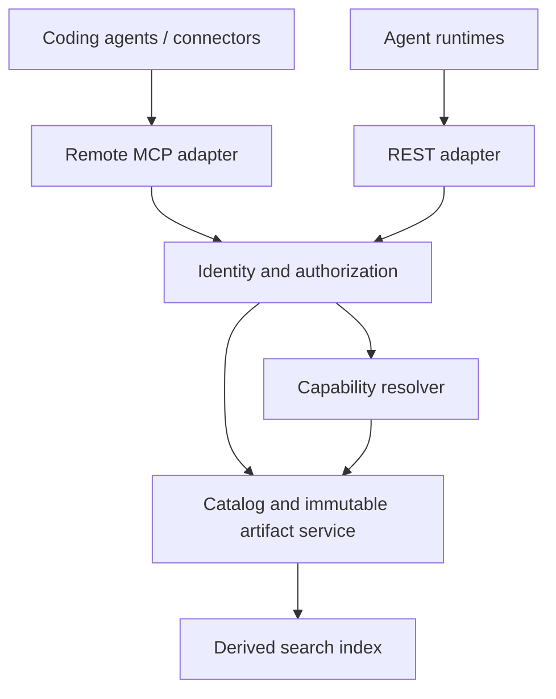

# RFC-002: Gist Hosted Skill and Execution-Schema Registry

- **Status:** Draft. Revision 2 (2026-09-25) applies an external design
  review (the registry/gateway split, governance and authorization sections,
  and the API-surface gaps below came out of it); revision 3 externalizes
  internal references for open-source publication; revision 4 (2026-09-25)
  aligns the package format, execution-schema vocabulary, connection flow,
  and effects classification with published standards and with runtimes that
  already own skill-import, tool-contract, connection, and protected-effects
  machinery, so Gist does not re-engineer what consumers already have.
  No deployment authorized by this RFC.
- **Updated:** 2026-09-25
- **Provisional service origin:** `https://gist.example.com`; final domain TBD
- **REST API:** `{service_origin}/v1`
- **Remote MCP:** `{service_origin}/mcp`
- **License:** to be set with the repository's open-source launch
- **Consumers:** coding agents (Codex, Claude Code, Cursor), assistant
  connectors (Claude.ai), and third-party agent runtimes — any client that
  wants governed skill discovery and retrieval
- **API version:** v1; independent of the existing Go module and CLI release versions
- **Planned follow-on:** RFC-003 (execution gateway) — see §17

## 1. Decision and purpose

Build Gist as an open service through which agents discover and retrieve
skills, execution schemas, and resolved capability bindings. Agents receive a
small discovery interface, select relevant capabilities, and fetch complete,
versioned artifacts on demand.

The first release is a registry: an authenticated catalog over HTTPS and
remote MCP. The governed execution gateway is a separate document, RFC-003,
with its own threat model; nothing in this RFC commits to it. A registry can
ship with zero executable providers — execution in a client, in an external
agent runtime, or through an existing provider integration must remain
possible without Gist in the call path.

Gist owns catalog publication, artifact identity, discovery, schema retrieval,
and capability resolution. Provider adapters (aggregators such as Composio and
direct APIs are illustrative) are pluggable, not privileged. Each consuming
runtime owns its conversation, context lifecycle, local execution environment,
and enforcement of its own policies.

This RFC replaces the earlier assumptions that returned schemas automatically
become native tools, that Gist can evict arbitrary client context, and that a
zero-token bootstrap is possible. Discovery definitions and retrieved content
consume tokens; savings must be measured against complete task outcomes.

## 2. Goals and release boundaries

### Registry release (this RFC)

1. Serve the same authoritative skill packages and execution schemas to all
   named consumers, with explicit adapters where necessary.
2. Support natural-language discovery and exact retrieval by immutable version.
3. Preserve complete `SKILL.md` packages, including referenced assets.
4. Isolate private workspace catalogs and enforce authorization on every read.
5. Support connector-based clients through a public remote MCP endpoint with
   OAuth.
6. Preserve the existing Go library, local CLI, and stdio MCP interface.
7. Return explicit unresolved requirements instead of implying that an
   incomplete capability set can execute a skill.
8. Launch with 3–5 providers spanning one aggregator, one MCP server, and one
   direct API; grow coverage evidence-driven (RFC-003/M-G2), not by a standing
   "all major providers" commitment.

### Outside this release (moved to RFC-003 or declined)

- Governed execution through approved providers, credential custody,
  idempotency ledgers, approval records, utility billing (RFC-003).
- Arbitrary hosted shell, Python, Node, or Go execution.
- Mandatory APQC classification, vector search, or a trained reranker.
- Automatic modification of a client's installed skills or global configuration.
- Guaranteed context eviction, system-prompt injection, or native tool hydration.

The data model keeps the hooks a gateway will need — `execution_location`,
declared `effects`, and binding versions — but defines no execution endpoints.

## 3. Repository baseline

The current repository supplies reusable indexing and retrieval components:

| Component | Current behavior | Hosted-service implication |
| --- | --- | --- |
| `gist.go` | Index, batch index, search, statistics | Reuse behind a catalog-search interface |
| `search.go` | Sequential stemming, trigram, fuzzy fallback | Establish a baseline before introducing hybrid search |
| `store_postgres.go` | PostgreSQL full-text ranking with `ts_rank` | Do not label this implementation BM25 |
| `store.go` | Sources and chunks | Add separate authoritative artifact and tenancy models |
| `mcp/server.go` | Stdio JSON-RPC, fixed protocol version | Add a remote transport with explicit version negotiation |
| `mcp/tools.go` | Index, search, statistics | Add a distinct catalog tool surface |
| `executor.go` | Local subprocess execution | Keep local; it is not a hosted isolation boundary |
| `session.go`, `snapshot.go` | Session events and budgeted snapshots | Useful locally; not control over external client history |

Search indexes are derived data. Skill packages, tool schemas, and versioned
bindings are authoritative records and must not be reconstructed from snippets.
A hosted catalog must not share a global unscoped store with private context
indexes. Existing library callers must not acquire network or credential
requirements merely by upgrading.

**The hosted service is a separate Go module** (a `hosted/` module in this
repository or a sibling repository, decided at M1). The public library must not
gain server, OAuth, or tenancy dependencies.

## 4. Client contract

### Stable MCP surface

The registry exposes a small, stable set of tools:

| Tool | Purpose |
| --- | --- |
| `gist_discover` | Find authorized skill/tool candidates using intent and filters |
| `gist_get` | Retrieve a complete manifest, instructions, or execution schema by exact reference |
| `gist_resolve` | Resolve a pinned skill's capabilities against available bindings |
| `gist_connect` | Return a `connect_url` for a capability that reports `requires_connection` |

Retrieved instructions remain lower-trust content. They cannot override host
instructions, acquire permissions, authorize side effects, or change identity.
Clients decide whether and where to include instructions in model context.

A discovered schema is data. Clients may use it to validate arguments, register
native tools when their runtime permits that, or wait for the RFC-003
invocation wrapper. The baseline never requires the client to change its native
tool list mid-conversation. Where a client can only execute through a generic
wrapper, that wrapper is RFC-003 work; until it exists, a resolution that
cannot execute in the requesting client reports `unsupported_runtime` or
`requires_gateway` rather than implying executability. Models produce weaker
arguments through a generic wrapper than through native typed tools; if RFC-003
adopts one, it must acknowledge and measure that quality cost.

Optional MCP resources, prompts, and change notifications may improve a client
experience but must not be required for basic retrieval.

### Integration matrix

These are implementation targets, not claims of completed compatibility.

| Consumer | Planned integration | Acceptance requirement |
| --- | --- | --- |
| Codex | Remote MCP; local adapter if the target build requires it | Authenticate, discover, retrieve exact package/schema, handle errors |
| Claude Code | Remote MCP and optional explicit package installation | Same workflow; no assumption that a tool result installs a skill |
| Cursor | Remote MCP or supported local bridge | Verify supported transport, auth, and schema subset on the selected build |
| Grok Bot | **Identification spike, not an acceptance line.** The client's vendor, transport, and OAuth support are unverified (its installed package reports a Cursor-family bundle identifier). Spike: identify vendor, transport, and OAuth support on a named build; implement a bridge only if required; drop from the matrix if unsupported | Spike result recorded before any milestone cites this consumer |
| Claude.ai | Public remote MCP with OAuth | Add custom connector, consent, discover, retrieve, refresh, revoke |
| Third-party runtimes | REST or MCP adapters into their skill/artifact APIs (§13 defines the two adapter archetypes) | Preserve package import, installation identity, validation, and worker policies |

Claude.ai initiates remote MCP connections from Anthropic infrastructure. Its
connector cannot depend on a localhost service or a local filesystem path, and
its remote-connector flow supports OAuth. See
[Claude's custom connector documentation](https://support.claude.com/en/articles/11175166-get-started-with-custom-connectors-using-remote-mcp).
Because requests originate from Anthropic infrastructure, the data-residency
and subprocessor implications of Claude.ai-issued requests touching Gist and
its connected workspaces are recorded in the M2b design and disclosed to
workspace operators.

## 5. System architecture



Both transports use the same application services and authorization decisions.
The implementation is one Go service with clear internal module boundaries;
separate deployment units only when isolation or workload evidence requires
them. PostgreSQL stores catalog metadata and policy-related records; an object
store holds immutable package bytes. Search indexes are rebuildable from
published records.

The public hostname is a target, not evidence of an existing deployment.
Hosting, authorization-server strategy, DNS, certificates, and resource
ownership must be recorded in the operations plan before release. **The domain
decision is made before M2b starts**: OAuth audiences, redirects, and connector
configurations bind to the hostname, and deferring it invites reworking
everything M2b produces. Artifact IDs and provider IDs never embed the
hostname (§6).

## 6. Authoritative data model

### Skill package

A skill is an immutable versioned package containing a manifest, `SKILL.md`,
and optional references, scripts, and assets. Required manifest fields are:

- `manifest_version`, globally namespaced `id`, `version`, and package digest.
- `name`, `summary`, publisher identity, source revision, and license metadata.
- Package entrypoint and complete file inventory with file digests and sizes.
- Required capabilities with contract-version constraints.
- Runtime requirements, including local execution or filesystem requirements.
- Declared effects (from the controlled vocabulary in §11) and review/publication status.
- Optional taxonomy memberships and tags.

**Package format.** The instruction core of a Gist skill package is the
published **Agent Skills format** (`SKILL.md` entrypoint with its name and
description metadata, optional references, scripts, and assets). The Gist
manifest is an **extension layer** over that core: it adds the fields a
registry needs to resolve — `manifest_version`, namespaced `id`, immutable
`version`, capability requirements, execution effects, trust, and publication
metadata — without replacing any Agent Skills field. Two interop requirements
follow, and both are acceptance criteria for M1:

- A Gist skill version's instruction core must import cleanly through a
  validating Agent Skills import adapter (archive validation, metadata checks,
  scripts never executed during import).
- A package authored in the Agent Skills format without Gist extensions must
  be wrappable into a valid Gist skill version; the registry derives the
  missing manifest fields from publication metadata, not from guesswork, and
  marks the derived fields as unverified until a publisher completes them.

Gist does not mint a second packaging standard. Where a consuming runtime
already validates and installs skill packages in this format, the Gist
adapter's job is retrieval and digest verification only (§13).

**Digest closure.** The package digest is computed over the file inventory
*excluding the manifest itself*; the manifest carries `package_digest`, a
digest of every file it lists except the manifest. A client verifies the
package by hashing the retrieved files (manifest included, after byte-exact
transfer) against their per-file digests, then re-computing the package digest
over the manifest's declared inventory. This removes the self-reference in
revision 1, where the manifest appeared to carry the digest of the bundle that
contains it. When manifest version, per-file digests, and package digest
disagree, the transfer is invalid and the service returns an integrity error;
the client pins the exact `(id, version)` and treats the version string as the
only mutable-alias-free handle.

Example of the manifest fields used for resolution; file inventory and
publication metadata are returned by the full manifest endpoint:

```json
{
  "manifest_version": "1",
  "id": "acme/hr/onboard-engineer",
  "version": "1.0.0",
  "name": "Onboard an engineer",
  "entrypoint": "SKILL.md",
  "required_capabilities": [
    {"id": "gist/identity/user.create", "contract_version": "1"},
    {"id": "gist/document/resume.parse", "contract_version": "1"},
    {"id": "gist/communication/channel.invite", "contract_version": "1"}
  ],
  "runtime_requirements": {"local_execution": false},
  "effects": ["creates_identity", "sends_invitation"],
  "trust": "operator_asserted",
  "tags": ["hr", "onboarding"]
}
```

Instructions should describe capability semantics without naming providers when
the skill claims provider portability. A provider-specific skill may name the
provider, but must declare that dependency explicitly.

### Capability contract

A capability defines a stable semantic operation, versioned input/output types,
and effects. Similar names do not establish interchangeability. A provider
adapter must map and validate arguments and outputs against the capability
contract; incompatible semantics require a different contract or version.

Capability contracts are governed artifacts (§11): each has an owner, a
namespace, version rules, and golden fixtures that adapters must pass.

### Execution schema

An execution schema identifies an exact tool version and contains:

- Input and output JSON Schemas, with an explicit schema dialect.
- Provider and provider action/version identifiers where applicable.
- Execution location: `client`, `runtime`, or `gist_gateway` (the last only
  becomes meaningful under RFC-003).
- Required authorization scopes, connection type, and declared effects.
- Timeout, retry, idempotency, and async-status capabilities.
- Provenance, digest, lifecycle state, and provider-schema capture timestamp.

Use JSON Schema 2020-12 as the canonical storage dialect. Transport adapters
must publish their supported subsets and apply the conversion policy in §11.4:
security-relevant constraints (`additionalProperties`, `enum`, numeric/string
bounds, `required`) must fail closed — a normalization that would weaken any
of them is rejected and the provider record is marked `degraded` with the loss
disclosed. Description-only or documentation-only loss does not block
cataloging; the adapter records it in the loss report. Every invocation is
validated server-side when Gist executes it (RFC-003). A schema endpoint does
not imply an executable endpoint.

**Execution schemas must compile into runtime tool contracts.** A consuming
runtime that maintains its own tool-contract registry (stable tool
identity/version, typed input/output schemas, effect classification, outbound
destinations, credential requirements, cost bounds, timeout, and idempotency
semantics) must be able to derive a complete tool contract from a Gist
execution schema plus its capability contract, without additional
information. The fields above are that derivation's required coverage; the
M1 schema review verifies each one is expressible and unambiguous. Effect
classification (§11) maps the schema's declared effects onto the runtime's
own read/disclosure/mutation-style classification; a runtime must not need
lossy string matching to classify a Gist-resolved tool.

### Provider registry

The launch inventory is the 3–5 providers selected for M1. The eight-family
coverage goal, per-provider support states (`planned`, `catalog_only`,
`resolvable`, `executable`, `degraded`, `retired`), the adapter contract, and
the credential-handling rules moved to RFC-003; this RFC retains only what the
data model needs:

- A provider record with stable identity, support state, and last-verified
  timestamp.
- A binding connecting a capability to a tool, with argument/output adapter
  metadata and version. A direct API route and an aggregator route to the same
  service are separate bindings.
- A versioned binding never publishes account identifiers from one workspace
  in another workspace's responses.

Credential custody, egress controls, and connection ownership are RFC-003
concerns, except for the connection-initiation surface this RFC needs to make
`requires_connection` actionable (§8, §9).

### Binding and resolution

A versioned binding connects a capability to a tool and an argument/output
adapter. Workspace-specific account selection is separate from public schema
metadata.

A resolution records exact skill, capability, tool, and binding versions;
authorized connection references; unresolved requirements; and an expiry.
A resolution is **not** an execution grant. Recheck current policy and
revocation when executing, even if the resolution or artifact is cached.
Resolutions carry **per-requirement findings** (one entry per required
capability, each `ready` / `requires_connection` / `requires_selection` /
`incomplete` / `unsupported_runtime`), are bound to the principal and workspace
that requested them, are not aliases (exact versions only), are short-lived,
and expire. `ready` requires every per-requirement finding to be `ready`.

Readiness rests partly on client/runtime assertions Gist cannot verify
(connection ownership, credential availability). A resolution states what it
verified and what it trusted the client on; the RFC-003 gateway re-verifies
everything server-side before executing.

### Lifecycle and integrity

Versions are immutable. Publishing changed bytes requires a new version.
Resolve mutable aliases such as `latest` to exact versions before returning
artifacts. Deprecation preserves retrieval where policy allows; revocation
blocks new resolutions and execution. Provide explicit revocation errors for
clients holding cached content. A digest establishes integrity, not publisher
trust or execution safety.

Revocation and new-version notices are exposed as an **event feed**
(polling endpoint or webhooks, defined in the M1 authorization ADR) that
runtime adapters are required to consume. Without it, a revoked malicious
skill version keeps executing in a runtime until a human notices. Server-side
revocation is nevertheless advisory for `client` execution: Gist cannot erase
a client's local copy, and the retention limit for already-downloaded content
is documented in §9.

## 7. Publication and package handling

Initial publication is restricted to trusted workspace maintainers and service
operators, through an authenticated ingestion command/API outside the
agent-facing MCP surface (§9 adds the endpoints). Publication proceeds through:

1. Import from an explicitly selected repository revision or uploaded package.
2. Validate manifest, capability contracts, schema dialect, references, license
   metadata, limits, and package integrity (per the digest closure in §6).
3. Reject archive traversal, absolute paths, unsafe links, oversized expansion,
   executable hooks during ingestion, and missing required files.
4. Record publisher, source revision, artifact digests, and review decision.
5. Atomically publish an immutable version and enqueue derived indexing.

Do not execute imported scripts during indexing. Treat package text as untrusted
content during classification and retrieval. Publication-time screening covers
`SKILL.md`, summaries, and referenced scripts for prompt-injection payloads
before a package becomes visible; the screening criteria are part of the M1
governance deliverable. Validate provider catalogs through explicit adapters; an
OpenAPI document or tool schema is not automatically a complete skill.

**Trust posture.** Until a publisher-signing scheme exists (designed in
RFC-003 §2.7), every package is marked `trust: operator_asserted` at most, and
public distribution is blocked — packages are workspace-private. Public
distribution requires publisher signature or provenance (e.g. Sigstore) and a
written verification procedure; `verified` is never claimed without them.

Private workspace visibility is the default. External references must not cause
unrestricted server-side URL fetching.

## 8. Discovery and resolution

The first retrieval pipeline is authorization filtering, lexical retrieval,
metadata filtering, deterministic ranking, and bounded candidate generation.
Filter before ranking and limiting so unauthorized records cannot influence
visible counts, snippets, or selected candidates. Include authorization scope
in cache and index-query boundaries. The M1 authorization ADR (§12) specifies
how cursors, counts, snippets, and timing avoid becoming enumeration oracles.

Discovery returns compact summaries, immutable references, estimated retrieval
size, and declared requirements. It does not return entire packages by default.
A client retrieves the full selected instructions and schemas separately.

Resolution must account for all required capabilities and distinguish:

- `ready`: all requirements resolve for the requested runtime.
- `requires_connection`: an authorized capability needs account connection;
  the response carries a `connect_url` (§9) the human can act on. A runtime
  that **owns its own connection lifecycle** (a typed
  begin/status/complete/cancel challenge flow with credential custody outside
  the model context) MAY satisfy this finding itself instead: it connects
  through its existing flow, then re-requests resolution with the connection
  asserted. Gist then marks the finding `ready` on that runtime's assertion
  and records it as **client-asserted** — the same disclosed trust boundary
  as connection ownership above. Gist's own connection endpoints serve
  clients with no connection system of their own, and the RFC-003 gateway;
  they are never a second consent flow for a runtime that already has one.
- `requires_selection`: multiple eligible bindings need explicit selection.
- `incomplete`: one or more required capabilities have no eligible binding.
- `unsupported_runtime`: requirements cannot run in the selected client.
- `requires_gateway`: execution needs the RFC-003 gateway, which does not exist.

Describe failures without disclosing inaccessible catalog entries or accounts.
Optional dependencies are explicitly marked and cannot masquerade as required
ones. A partial resolution never reports `ready`.

**Budgets are bytes, not tokens.** Requests carry `max_bytes` (enforced) and an
optional `token_estimate` style preference; the service reports a
`token_estimate` (labeled approximate, computed by a documented estimator) for
context sizing. Token counts are tokenizer-specific and the service will not
guarantee them. Budgets may reduce candidate count or omit optional descriptive
text; they must **never truncate** an executable schema or required instruction
file. If required content exceeds the budget the response fails explicitly with
`payload_too_large` (413 semantics, `code: budget_exceeded`) rather than
serving a silently incomplete artifact; oversized artifacts use explicit
retrieval or package download flows. Return no matches when appropriate instead
of forcing a result.

Interaction cost is a design constraint: the happy path is discover → get →
(resolve) → (act), and the M3 acceptance includes a measured round-trip count
and a batch retrieval option so a typical task does not cost four-plus
round trips by construction.

Dense retrieval, reciprocal rank fusion, and reranking are optional future
improvements. Adopt them only after evaluations show useful gains (§15, M4).

## 9. HTTPS API

All endpoints require authentication except health checks and intentionally
public authorization-discovery metadata. Publication uses separate scopes.

| Endpoint | Contract |
| --- | --- |
| `POST /v1/discover` | Authorized candidates and opaque pagination cursor |
| `GET /v1/skills/{id}/versions` | List immutable versions with lifecycle state (drives "new available version" flows in importing runtimes) |
| `GET /v1/skills/{id}/versions/{version}` | Full manifest, integrity metadata, instructions/package references |
| `GET /v1/skills/{id}/versions/{version}/package` | Authorized immutable package bytes |
| `GET /v1/tools/{id}/versions/{version}` | Complete execution schema |
| `GET /v1/capabilities/{id}/versions/{version}` | Capability contract and golden fixtures (§11) |
| `POST /v1/resolve` | Pinned resolution and explicit readiness |
| `POST /v1/connections` | Begin an account connection for a capability/binding; returns `connect_url` + pollable connection record. **For clients without their own connection lifecycle** (and for RFC-003 gateway execution) — a runtime that owns connections satisfies `requires_connection` through its own flow instead (§8) |
| `GET /v1/connections/{id}` | Connection status (for the client to poll after the human completes consent); not consumed by runtimes with their own connection lifecycle |
| `GET /v1/taxonomies` | Authorized taxonomy metadata and available editions |
| `GET /v1/taxonomies/{id}/nodes` | Paginated nodes; no mandatory full-tree download |
| `POST /v1/publish/...` | Publisher-only ingestion routes (separate scope; outside the MCP surface) |
| `GET /v1/events` | Revocation and new-version feed for runtimes (M1 ADR defines shape and retention) |

Route IDs are opaque URL-safe registry keys; manifests may carry slash-separated
logical names. Clients use returned canonical URLs instead of constructing URLs
from logical names. Version strings are validated and escaped.

Example discovery request:

```json
{
  "query": "Onboard an engineer and parse their resume",
  "kinds": ["skill"],
  "tags": ["onboarding"],
  "max_results": 3,
  "max_bytes": 6000,
  "runtime": {"local_execution": false}
}
```

Representative candidate response:

```json
{
  "candidates": [
    {
      "kind": "skill",
      "id": "sk_onboard_engineer",
      "logical_name": "acme/hr/onboard-engineer",
      "version": "1.0.0",
      "summary": "Create an identity, parse a resume, and invite the engineer to a channel.",
      "manifest_url": "/v1/skills/sk_onboard_engineer/versions/1.0.0",
      "required_capability_count": 3,
      "resolution_required": true,
      "trust": "operator_asserted"
    }
  ],
  "next_cursor": null
}
```

The API derives tenant and subject from validated credentials and authorized
workspace selection, never from an untrusted caller-supplied tenant identifier.
Requests carry a request ID; errors contain `code` (from an enumerated set
published with the API: `unauthorized`, `forbidden`, `not_found`,
`version_conflict`, `budget_exceeded`, `validation_failed`, `rate_limited`,
`service_unavailable`, plus later additions), a safe `message`, `request_id`,
and `retryable`. Use consistent HTTP status semantics, including 401, 403, 404,
409, 413, 422, 429, and 503. The 404-vs-403 policy for private artifacts is
fixed by the authorization ADR (§12) and applied identically to manifests,
packages, taxonomy nodes, and resolutions. Rate-limit by principal and
workspace; return `Retry-After` where applicable.

Use ETags/digests for immutable artifacts with private cache controls. A cached
response never bypasses fresh authorization when the service is contacted.
Document the retention limit for already-downloaded content: server revocation
cannot erase a client's local copy.

## 10. MCP transport and OAuth

Expose `/mcp` using Streamable HTTP. Select and pin protocol revisions with
implementation and client interoperability evidence; keep revision-specific
transport behavior explicit. Do not copy the local server's fixed initialization
response into the hosted service. See the
[MCP transport specification](https://github.com/modelcontextprotocol/modelcontextprotocol/blob/main/docs/specification/2026-07-28/basic/transports/streamable-http.mdx).

**Authorization server requirements.** Gist is a protected resource server and
needs an OAuth 2.1 authorization server. Two supported strategies:

1. **Built-in reference authorization server.** The reference deployment ships
   a minimal OAuth 2.1 AS implementing the requirement set below. This is the
   default, and the fallback for every deployment.
2. **Delegated issuer.** A deployment may delegate issuance to an external
   OAuth 2.1 authorization server, provided it passes the same requirement
   checklist. The checklist is the acceptance test for this decision:

| Requirement | Why |
| --- | --- |
| RFC 8414 authorization-server metadata discovery | Clients locate the AS without configuration |
| RFC 7591 dynamic client registration | Connector clients (e.g. Claude.ai custom connectors) self-register; https-only redirect URIs; scopes reject-not-downgrade |
| Authorization code + PKCE (S256 only), single-use codes, consent | Public-client baseline for MCP |
| Refresh tokens with rotate-on-use and family revocation on reuse | Token theft containment |
| RFC 9728 protected-resource metadata (real PRM document, not just `WWW-Authenticate` challenges) | MCP 2026-07-28 clients fetch the PRM first; the challenge header alone is partial |
| RFC 8707 resource indicators with `aud` binding | A token minted for Gist must not be replayable at another resource the same issuer serves |

An external issuer that fails any line falls back to strategy 1; the checklist
is recorded per deployment so the gap is named, not discovered at connector
onboarding.

Publish protected-resource metadata and authorization-server discovery; support
authorization code with PKCE and the client-registration mechanisms required by
the accepted client matrix. Validate issuer, audience/resource, expiry, scopes,
and workspace membership. Specify refresh, revocation, and consent behavior.

Proposed scopes are `catalog:read`, `catalog:publish`, and, later (RFC-003),
`execution:invoke`. Scopes are upper bounds; resource policy further restricts
each operation. Machine consumers may use separately provisioned short-lived
workload tokens. Clients must never paste provider API keys or permanent
service tokens to Gist.

MCP transport authentication failures use appropriate HTTP challenges; operation
failures use the negotiated MCP tool-error contract. Reject unsupported protocol
versions clearly. Validate origins where relevant and apply request-size,
connection, and request-rate limits.

Gist access tokens are never forwarded as upstream provider tokens. Provider
credentials and connected-account references have distinct trust boundaries.
See
[MCP authorization](https://github.com/modelcontextprotocol/modelcontextprotocol/blob/main/docs/specification/2026-07-28/basic/authorization/index.mdx).

## 11. Governance

Three things the registry distributes, it must also own. This section is an M1
deliverable; the details below are the requirements the governance ADR
formalizes.

### Capability contracts

- **Owner.** Every capability ID names an owning workspace or `gist` core.
  Core capabilities (`gist/identity/user.create`, `gist/communication/channel.invite`)
  are governed by the Gist service operators; workspace capabilities by that
  workspace's maintainers.
- **Namespace.** Capability IDs are namespaced like skill IDs
  (`gist/…` reserved core; `{workspace}/…` private). Namespace prefixes are
  publisher-bound; publication under a prefix the publisher does not own is a
  409, and the reservation policy is part of the governance ADR.
- **Versioning.** `contract_version` follows additive-is-minor: new optional
  fields bump the minor; any semantic change to existing operation semantics is
  a new contract version, and bindings pin the exact contract version.
- **Conformance.** Each binding ships golden fixtures (sample input/output
  pairs) the adapter must transform correctly; conformance check results are
  recorded on the binding and visible in the manifest. Disputes over "semantic
  compatibility" are resolved by the contract owner, with a documented dispute
  path.
- **Retrieval.** `GET /v1/capabilities/{id}/versions/{version}` returns the
  contract; resolution and adapter validation depend on it, so it is a
  first-class endpoint, not metadata.

### Trust and effects

- Trust states are `operator_asserted` (today's ceiling) and, after signing
  exists, `verified` (§7). Public distribution is blocked until then.
- `effects` is a versioned controlled vocabulary, not free-form strings; policy
  gates (sensitive-effect approval, redaction) match on it. The vocabulary is
  owned like a capability contract: additive additions are minor, renames or
  semantic changes are new versions.
- Every `effects` term **declares its effect class** — read-only, disclosure
  (exposes data), or mutation (changes external state) — and sensitivity. This
  lets a consuming runtime's own tool-contract classifier derive its
  classification for a Gist-resolved tool from the declared class, not from
  name-matching; and it lets a runtime's existing approval gates route
  sensitive effects without re-classifying from prose. The class declarations
  are part of the vocabulary's versioned contract.
- Publication-time screening (§7) is a release gate, not a best effort.

### Taxonomy and visibility

Stable artifact and capability identities are independent of taxonomy paths.
Support optional multiple memberships and custom tags. Taxonomy editions are
versioned; reclassification must not silently change execution permissions.
Publication visibility is a publication-time setting, not an after-the-fact
reclassification.

**Gist Business Activities (`gist-activities/1`).** The default discovery
taxonomy is a Gist-owned reference distilled from APQC PCF v8.0
(Cross-Industry, February 2026) — 13 categories, 74 process groups, 362
processes — defined in `docs/taxonomy/gist-activities-1.md`. The license
verification §7 required is done: APQC's PCF license grants a perpetual,
royalty-free right to create and publish derivative works, conditional on
carrying APQC's attribution block. That attribution is a **hard requirement**:
it is machine-attached to the taxonomy edition and must be served with every
taxonomy response and preserved in downstream copies. Node IDs are Gist-owned
and stable; source `apqc_ref` numbers ride along as provenance metadata. A
full-PCF (L4–L5) import may follow as a separate edition under the same
attribution rule. The edition also seeds which `gist/…` core capability
families get defined first (activity-density guidance in the taxonomy
document); capability identity remains independent of taxonomy paths.

APQC remains one possible *imported, versioned* taxonomy edition among
others; the attribution condition above is the standing template for any
imported edition: verify edition, identifiers, attribution, and
redistribution terms before it becomes resolvable.

## 12. Authorization model (M1 ADR deliverable)

The authorization model is specified as a written ADR **before M2
implementation begins**, not during it. The RFC fixes the requirements; the
ADR fixes the mechanism. Required content:

- **Workspace selection.** How a principal with multiple workspaces selects
  one, given §9's rule that tenant/subject derive only from validated
  credentials. Candidate mechanisms: a workspace claim in the issued token
  (mint-time selection) or a signed selection grant. The ADR names one,
  defines its binding into every authorization decision, and forbids
  caller-supplied workspace IDs as trust input.
- **Roles and visibility.** Public / workspace-private visibility semantics,
  roles (maintainer, reader), and how publication status interacts with both.
- **Isolation mechanism.** The concrete tenancy isolation (e.g. PostgreSQL
  RLS, schema-per-tenant, or query-level scoping), its blast radius if it
  fails, and the cross-tenant test matrix (IDs, cursors, counts, results,
  downloads, timing).
- **Oracle control.** Cursors and resolutions are server-side, short-lived,
  principal-and-workspace-bound records with no aliases; the ADR specifies how
  counts, snippets, suggestion, and error timing avoid leaking unauthorized
  existence (including the 404-vs-403 policy and response-shape uniformity for
  private artifacts).
- **Fail-closed.** Behavior when the policy store, the authorization server, or
  the search index is unavailable: discovery and retrieval fail; exact
  artifact retrieval by pinned reference MAY remain available when policy can
  still be evaluated; search failure never returns fabricated successful
  resolutions.
- **Revocation semantics.** Revocation is advisory for `client` execution
  (stated plainly — Gist is not in that loop); resolutions carry a lease/TTL;
  runtimes consume the §9 event feed and recheck at dispatch. The ADR defines
  the feed's shape, retention, and what a consumer must do on a missed event.
- **Cache discipline.** Every cache key includes identity/policy context;
  asynchronously indexed catalog content cannot leak revoked metadata or serve
  stale permissions (the invariant external review flagged: these paths share
  one explicit rule).

## 13. Runtime adapters

Consuming runtimes fall into two archetypes; each adapter must follow its
archetype's requirements rather than inventing a side channel.

### Policy-gated runtimes

Runtimes that derive per-worker authority from explicit grants and enforce
approval gates on sensitive effects (spending, sending, destructive actions):

1. Map each resolved capability to explicit tool URIs and versions; grants are
   exact-URI, never wildcard by taxonomy or family.
2. Preserve parent-principal bounds and keep spending policy separate from
   capability policy.
3. Report unresolved or unsupported bindings before a worker is marked ready.
4. Recheck current policy during dispatch and respond to revoked versions via
   the §9 event feed.
5. Preserve source skill and resolution references for audit and diagnosis.

Taxonomy membership cannot substitute for these grants.

### Artifact-importing runtimes

Runtimes with their own skill/artifact install lifecycle:

1. Retrieve complete packages, verify their digests (per the digest closure in
   §6), and import through the runtime's existing artifact-upload, validation,
   and worker-binding lifecycle. Do not invent a second import path that
   bypasses those contracts.
2. Define update behavior explicitly: show a new available version (via
   `GET /v1/skills/{id}/versions`), evaluate it, and update the binding through
   the normal runtime operation. Do not silently replace packages already
   attached to workers.

A runtime that already owns a **protected-effects engine** (attempt records,
`unknown`-outcome confirmation states, submission keys bound to
principal/operation, no hidden retries) maps Gist's execution semantics onto
that engine rather than adopting a parallel one: an execution schema's
idempotency and timeout fields become the engine's submission-key and
timeout inputs, and its declared effects (with their §11 classes) become the
engine's approval-routing inputs. RFC-003's execution machinery exists for
the gateway path — clients whose runtime cannot execute the resolved
capability — and must never be inserted into the call path of a runtime that
executes through its own engine.

## 14. Operations and rollout

Provide health/readiness endpoints, structured logs, request correlation,
latency/error metrics, database migration procedures, backups, restore checks,
and a rollback plan. Bound catalog size, package size, discovery work, and
concurrent requests. Exact artifact retrieval remains available when indexing is
delayed; expose publication/indexing state to publishers.

Deploy exclusively through IaC and a reviewed release pipeline: infrastructure
changes go through code review, CI, merge, release, deployment workflow, and
verification. Do not mutate live infrastructure manually.

**Pre-production environment.** OAuth redirect/consent behavior,
streamable-HTTP session semantics, and connector quirks are precisely the
defect class local/CI validation does not catch. M2b therefore uses a
**short-lived pre-production environment**: a temporary public-origin
deployment created through IaC for OAuth redirect, consent, and connector
testing, then torn down. It never holds production data; its DNS/OAuth
audience values are separate from production. Final M2b/M3 acceptance then runs
against the public deployment with dedicated test accounts in sandboxed
workspaces. Production-first testing is not the default path for multi-tenant
auth boundaries.

## 15. Delivery milestones and acceptance

### M1 — Contracts, curated catalog, governance, authorization ADR

- Publish formal manifest, capability, execution-schema, and error schemas,
  including the digest-closure fix (§6) and the `effects` vocabulary (§11).
- Include a skill with assets and a skill with multiple required capabilities.
- Define publisher review, immutable versions, revocation, and private
  visibility. Publication screening is a release gate.
- Select and ingest **3–5 launch providers spanning one aggregator, one MCP
  server, and one direct API**, demonstrating distinct integration routes
  rather than designing around one aggregator. The broad-provider inventory
  and its per-provider states move to RFC-003/M-G2.
- Write the **authorization ADR** (§12) and the **governance ADR** (§11).
- Map the §13 runtime-adapter contracts before implementing adapters.

### M2a — Hosted registry, workload tokens, one runtime

- Implement authorized discovery, exact retrieval, packages, version listing,
  and resolution with per-requirement findings.
- Short-lived workload tokens for one consuming runtime; few workspaces.
- Request limits, `max_bytes` budget semantics, error-code contract, and the
  event feed online.
- Keep the existing local library, CLI, and stdio tools compatible (separate
  Go module, §3).

### M2b — Multi-tenant OAuth and connector clients

- Complete OAuth against the configured authorization server (built-in
  reference AS, or an external issuer that passed the §10 checklist),
  transport negotiation, tenant isolation, and request limits.
- Exercise OAuth, consent, and connector behavior on the short-lived
  pre-production environment (§14) before any public contact.
- Demonstrate connector-based clients' connection, consent, retrieval,
  refresh, and revocation against the public deployment with test accounts.

### M3 — Named-client acceptance

- Record client product/build, transport, auth flow, schema subset, and outcome.
- Exercise Codex, Claude Code, Cursor, and at least one policy-gated runtime
  and one artifact-importing runtime (§13). Grok Bot enters only on a recorded
  spike result (§4); a partial launch lists unsupported clients explicitly.
- **Gate: a smoke-level labeled retrieval evaluation** (no-match, ambiguous
  intent, unauthorized candidates) passes before M3 acceptance — the M4
  evaluation's smaller precursor, pulled forward so the core UX is measured at
  first contact.
- Prove unsupported local-runtime requirements produce explicit errors.
- Verify complete package transfer and exact-URI policy preservation.
- Measure and record the discovery→get→resolve→act round-trip count and the
  batch-retrieval option (§8).

### M4 — Retrieval evaluation (full)

Build a labeled evaluation set across engineering and business workflows.
Measure relevant-skill recall, complete resolution, successful task completion,
total tokens, p50/p95 latency, and cost. Include no-match, ambiguous intent,
unauthorized candidates, and unavailable provider cases. Compare against the
same models, tasks, and tool catalogs. Set release targets from measured
baselines; do not invent token-reduction percentages or training claims.

## 16. Decisions required before implementation milestones

| Decision | Required by | Proposed default |
| --- | --- | --- |
| Authorization ADR (workspace selection, isolation, oracle policy, fail-closed, revocation feed) | M1 | Written ADR before M2; see §12 |
| Governance ADR (capability owners, namespaces, effects vocabulary, screening criteria) | M1 | See §11 |
| Hosted-service module placement (`hosted/` in-repo vs sibling repo) | M1 | Decided with the M1 ADRs |
| Authorization-server strategy (built-in reference AS vs delegated issuer) | M2a | Built-in reference AS per §10; delegation allowed only on a passed checklist |
| Final service domain and migration policy | M2b | Configurable origin; keep identity independent of hostname; **decide before M2b starts** |
| MCP protocol/client compatibility matrix | M2a/M3 | Pin verified revisions and document fallbacks |
| Launch-provider selection (which aggregator, which MCP server, which direct API) | M1 | By measured demand from early consumer workloads |
| Pre-production environment ownership and teardown policy | M2b | IaC-created, single-purpose, torn down after acceptance |
| APQC edition and redistribution permission | Before importing APQC | Optional classification; custom tags work without it |
| Data retention, package limits, and SLOs | M2a | Set explicit operational values from the curated-catalog baseline |

The registry contract and artifact model are independent of any particular
provider, APQC import, learned retrieval, and Gist-managed utility billing.
Individual adapter delays must not prevent other providers from serving
approved skills and execution schemas.

## 17. Moved to RFC-003

The following moved out of this RFC and into RFC-003 (`docs/rfc-003.md`), which
carries its own threat model: the governed execution gateway (`gist_invoke`,
`/v1/executions`), idempotency and reconciliation semantics, approval-record
binding, credential custody and connection-account authority, SSRF/egress
controls for arbitrary provider registration, the eight-family broad-provider
inventory and adapter contract, utility billing and the ledger it requires,
and the original M4/M5 milestones. The data-model hooks (`execution_location`,
`effects`, binding versions, resolution structure) remain here so the registry
does not need a breaking data-model change when RFC-003 lands.